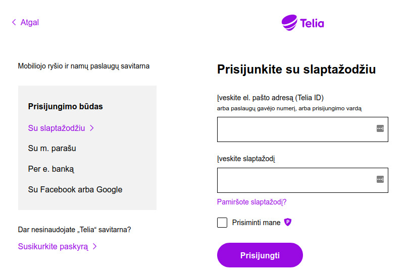
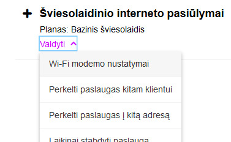
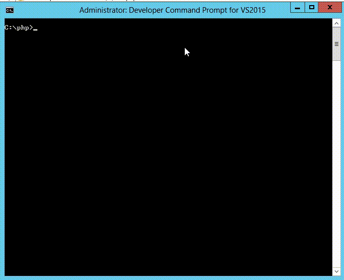
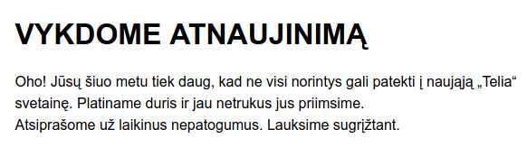
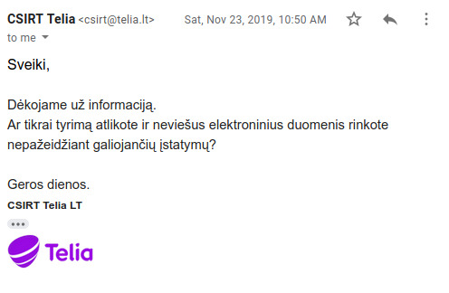
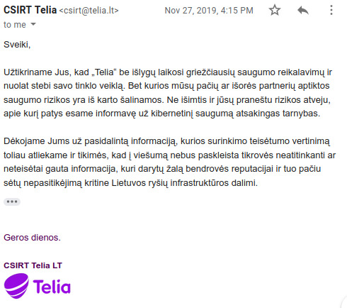
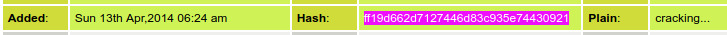

# FDEU-CVE-2019-10222

# Summary

Multiple vulnerabilities could allow running arbitrary code on an intranet server and gain root access on all the customers' routers

# Who is Telia

Telia is a Swedish multinational telecommunications company. It also operates in Lithuania and provides mobile service, FTTH internet, DSL internet and IPTV. Telia rents and sells custom routers and set-top tv boxes to customers which have limited or almost no administration access left to them.

# What is Telia backdoor

Every Telia router or tv box has a backdoor or "management interface". It is an `SSH` server running on VLAN 5 and/or WAN. Usually, it is running on port `8022`. Older models, like `ADB`, have password login enabled. The recent newer models, like `Technicolor`, have password login disabled and only use ssh with public key authentication (spoiler: it is still vulnerable).

# What is Telia Savitarna

Savitarna (in Lithuanian "Self service") - is a web service [https://www.telia.lt/mano/sso](https://www.telia.lt/mano/sso) that allows Telia customers to order and manage services, get invoices, pay bills etc. It uses password authentication or external authority logins such as Facebook, Google, banking, digital signature etc. One of the new features: changing your router's wifi password. Sounds interesting, right? An internet web service that is able to change your local router's wifi password.

Login page:

Change wifi settings:

# How Savitarna uses the backdoor

How that works. When a user wants to change the password, the web service calls the backend to initiate an SSH connection to the user's associated router. Depending on the router it will be either password authentication or RSA public key. After a successful login a PHP script on the backend will issue some commands in the router's shell, parse the result and output some of the data to the user in the web UI, like wireless network name. **Telia knows your WIFI password in plain text**, keep it in mind and do not reuse this password anywhere. Overall scheme:

# Under the hood

Let's take a look at how the SSH connection is established. Network capture shows an SSH client banner and the remote IP that initiated the connection:

`SSH-2.0-libssh2_1.4.2 PHP 10.0.98.251`

What is important here:

* Vulnerable `libssh2` version `1.4.2` [https://www.libssh2.org/security.html](https://www.libssh2.org/security.html)
* Weak and deprecated key exchange `diffie-hellman-group1-sha1`
* The client does not verify `remote SSH server public key` (see below)
* `PHP`

And, yes, it turns out that Telia's client does not attempt to verify the remote server's public key. We were able to start a custom SSH server on the same port 8022 and Savitarna successfully established a connection without even trying to verify for a man-in-the-middle. This means that we can see the password used and could try to create a malicious SSH server that exploits public vulnerabilities on Telia's side.

# Administrator password leak

That was an easy task. As soon as Telia's client connected to our malicious SSH server we got the universal router credentials:

<pre>
User: tadmin
Password: hqMV8Wps
</pre>

Do you still own an ADB router? Just go ahead and login over the web interface with this user. You are now an admin. You can do some restricted stuff now, great! But what about the root shell? We were able to connect with those credentials locally and got a limited shell. That's nice too. This gave us a lot of additional information that was hidden inside the router, many more vulnerabilities. Using one of them we were able to escalate to root and got full access over the device. The newer models like Technicolor require some additional exploits chained to gain full root access, but all are publicly available and so - easily doable.

# Using malicious SSH server to trigger server side RCE

In order to exploit RCE we needed to build a virtual test environment that fully copies Telia's PHP client. Step by step we have gone through the sequence of Telia's commands sent over the SSH. And finally we got a malicious SSH server and a test libssh2 client running in our test lab. With this server we could fully control the protocol and start fuzzing.

In the first few days of the fuzzing we got some crashes and partially confirmed that RCE may be exploited. Here is a sample GIF video that demonstrates two kinds of the issues the fuzzer found for us. Same php file was executed twice, but the malicious SSH server sent different payloads which caused:

* Segfault (stack corruption)
* Infinite loop with high CPU

However, at the time of the report we couldn't find an easy way to exploit the stack corruption. It may require more time, longer and more sophisticated fuzzing and more knowledge about the server. As Lithuanian law prohibits exploit testing on the real server, we could only fingerprint the Windows OS, but nothing more.

# DoS

The backend seems to run only 5 php processes, so it is fairly easy to perform DoS by keeping stalled ssh connections. When SSH connections stay active for too long filling all the 5 php processes (there seems to be no timeout reading the remote shell), the Savitarna will show a strange "Maintenance" message:

Translation:

<pre>
An update is in progress
Too many of you are trying to access the new Telia webpage.
We are expanding the resources and will accept you all soon.
Apologies for any inconvenience
</pre>

# All together: backdoor, weak password and RCE

If we now get all together, an attacker could exploit RCE on the intranet server and use that server to move laterally (because `10.0.98.251` is whitelisted everywhere) across all the customer routers with the same credentials creating the most powerful, persistent and undetectable botnet of Lithuania. Who knows, maybe someone already exploited that? (spoiler: see bonus section)

# Telia tries to threaten the researcher

The report was responsibly disclosed to Telia and a copy sent to `CERT LT` ([NKSC](https://www.nksc.lt)). What happened next was a little bit of a surprise to the team. There were rumours previously about Telia's poor tech level, but we have experienced this in a real case.

First, Telia did not have a PGP key and did not know how to use it, so instead they asked us to ZIP the report with password and send the password over a separate email (private GMail). I hope Telia's engineers will be reading this article, so I would like to explain why the report should be encrypted. This is to protect you as the affected vendor. If there is a man in the middle who can intercept all the researcher's traffic, it will be very easy to get the ZIP file in the first email and then the password in the second email. Instead, PKI like PGP only allows to decrypt the report by the private key owner, ensuring that nobody else can intercept the report and exploit the vulnerabilities before you fix them all.

Second, Telia tried to threaten the reporter for the vulnerability discovery:

Translation:

<pre>
Thank you for the information
Are you sure you did not violate the electronic data protection law?
</pre>

Original:

<pre>
Dėkojame už informaciją.
Ar tikrai tyrimą atlikote ir neviešus elektroninius duomenis rinkote
nepažeidžiant galiojančių įstatymų?
</pre>

And then they once again mentioned that they will check if this report wasn't a hacking attempt and that they will persecute any reporter that discloses any information about Telia vulnerabilities:

Translation:

<pre>
Thank you for the information. We will continue to check whether you made your report
legally without violating any law. And we will ensure that no fake information will be
published that could do any harm to the company's reputation and to the critical part
of Lithuanian network infrastructure.
</pre>

Original:

<pre>
Dėkojame Jums už pasidalintą informaciją, kurios surinkimo teisėtumo vertinimą toliau
atliekame ir tikimės, kad į viešumą nebus paskleista tikrovės neatitinkanti ar neteisėtai
gauta informacija, kuri darytų žalą bendrovės reputacijai ir tuo pačiu sėtų nepasitikėjimą
kritine Lietuvos ryšių infrastruktūros dalimi.
</pre>

We will not comment on this and let the IT community to judge. At the same time we will no longer provide any reports in any form to Telia company.

| Vulnerability      | Fixed?    | Comment                              |
|--------------------|-----------|--------------------------------------|
| Vulnerable libssh2 |    NO!    | [SSH-2.0-libssh2_1.8.0 PHP](https://www.libssh2.org/security.html)            |
| Weak KEX           | partially*| diffie-hellman-group-exchange-sha256 |
| MITM               |    NO!    | still no pub key check               |
| Password leaked    |    NO!    | password has not been rotated        |

\* Note: partial fix for KEX means the new KEX is not considered to be weak, however it is now possible to exploit libssh2 vulnerabilities after 1.8.0 with this particular KEX and a publicly known exploit for [KexAlgorithms diffie-hellman-group-exchange-sha256](https://github.com/Semmle/SecurityExploits/blob/446048470633bf0f8da9570d008d056dbaa28ea9/libssh2/out_of_bounds_read_kex_CVE-2019-13115/server/home/diff.txt)

# Bonus

After getting the root access and analyzing the Telia's routers' firmwares, we found several more users, like `ladmin` and `technician`. We will not disclose those passwords (yet), as it is not clear yet how both are used. But we were surprised that Telia's passwords appeared to be leaked many years ago. You can try to search for the tadmin password's hash on the web and you will be surprised - there was an attempt to crack the hash back in 2014!

<pre>
echo -n hqMV8Wps | md5sum
ff19d662d7127446d83c935e74430921  -
</pre>

[Webcache](https://webcache.googleusercontent.com/search?q=cache:J9ef6qUfrCcJ:www.md5this.com/list.php%3Fpage%3D108462%26key%3D1%26author%3DToXiC%26country%3DCyprus%26city%3DNicosia+)

And finally, we found that the hash was cracked and was available in the old "weakpass" database. You can search for the "old" weakpass database (sometimes named "First version of weakpass") and grep it - password is there. This means that most probably we are not the first who were able to penetrate Telia.

# Timeline

<pre>
2019-10-22 - tried to get in touch with Telia and asked for PGP key
2019-10-23 - password protected ZIP sent to Telia as they asked
2019-10-24 - Telia confirmed that report had been received
2019-11-21 - disclosure reminder sent to Telia
2019-11-23 - Telia tried to threaten the reporter
2019-11-27 - Telia confirmed that everything was safe, vulnerabilities were "always fixed"
2020-06-29 - full disclosure
</pre>

