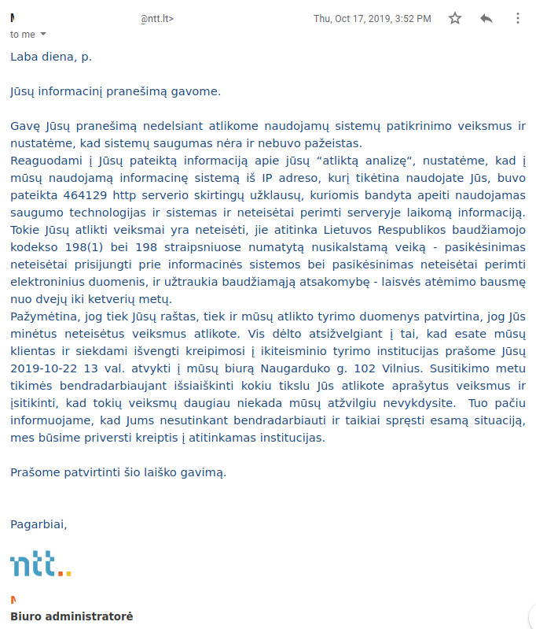
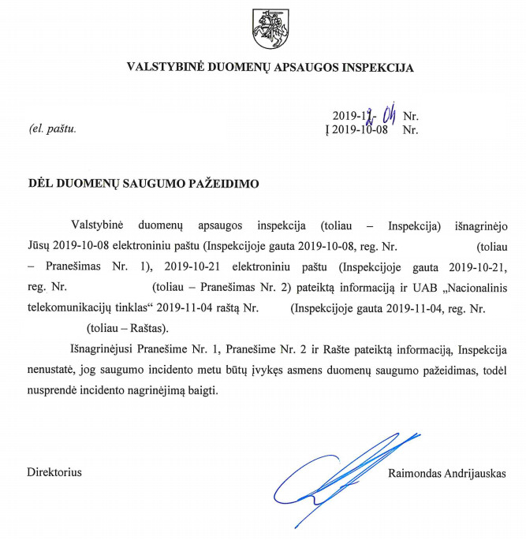

# FDEU-CVE-2019-275B

10 years old SQL injection in Spykas VoIP provider could allow an authenticated remote attacker to deploy a web shell, leak personal data and use SIP credentials for free calls.

# Who is NTT

NTT - Nacionalinis telekomunikacijų tinklas (National telecommunication network), even though it has "National" word, is a private company in Lithuania that provides internet, IPTV and VoIP services. In 2020 it had 2-3 million eur turnover and average salary 2143 eur.

# What is Spykas

Spykas is a VoIP brand and B2C service providing Zoiper based softphone.

# How Spykas works

Spykas has a self service web frontend at [https://my.spykas.com](https://my.spykas.com), where any user can register (no email verification needed). After registering the user can top up the account using a local bank and download a softphone - branded version of Zoiper that contains a unique user SIP password. The softphone works on AIX UDP protocol. Authentication uses standard SIP-MD5 digest authentication.

# Initial report in 2017

As a regular Spykas users we got an error message during the top up in 2017:

<pre>
Notice: Undefined variable:
VK_STAMP in /var/www/spykas_pay/psystems/hanza/hbstatus.php on line 204

Notice: Undefined variable:
VK_REC_PANK in /var/www/spykas_pay/psystems/hanza/hbstatus.php on line 274
DB error processing data.. try again later:
INSERT INTO invoice_number (fk_transaction_id) 
VALUES ('xxxxxxxxxxxxxxxxxxxxx')Duplicate entry 'xxxxxxxxxxxxxxxxxxxxx' for key
</pre>

For some this error would be just a frustrating user experience. Your money is gone from the bank account, but the service just showed you a meaningless error. But for others, like professional programmers, there is a smoking gun and "SQL INJECTION" written in all caps.

We contacted the support, provided the details: exact error text, bank account number, top up amount, etc. In about 15 minutes money got to the virtual Spykas account. That was a quick fix! 

# Same error in 2018

In 2018 during another top up we got the exact same error. We again saved all the message details and informed Spykas. While waiting for the response, we checked the balance - money arrived despite the error. The user experience was poor, but in the end the service did it's job: the softphone worked, and you only needed the web once or twice a year to top up.

The error mentioned the same code line as in 2017:
```
hbstatus.php line 204 and hbstatus.php on line 274
```
That indicated that the fix in 2017 landed in some other file, or nothing was fixed at all.

# Disclosure in 2019

When we got the same error in 2019, we decided to collect more information and involve the local GDPR agency - Asmens Duomenu Inspekcija (ADA). Using a simple OWASP ZAP proxy we were able to identify where exactly the injection happens. The transaction ID was being generated on the server side, but after that it was outputted to the user to be supplied in the consequent payment request to the bank. At this point the transaction ID was fully controlled by the user. And it turned out that the server was not using SQL prepared statements. Putting a single quote in the transaction id yielded this error:

<pre>
DB error processing data.. try again later: 
INSERT INTO hanza_query (vk_service, vk_version, vk_snd_id, 
   vk_stamp, vk_amount, vk_curr,
   vk_acc,vk_pank,vk_name,vk_ref,vk_msg,vk_mac,vk_return,vk_lang)
   VALUES ('xx','xx', 'NTT', ''INJEKCIJA', 5.00, 'EUR', 'xx', 'xx', 'NTT (Spykas)',
   ''INJEKCIJA','Saskaitos papildymas Spyko numeriui xx','xx',
   'https://my.spykas.com/psystems/hanza/hbstatus.php','LIT')
You have an error in your SQL syntax; check the manual that
corresponds to your MySQL server version for the right syntax to use near
'INJEKCIJA', 5.00, 'EUR', 'xx', 'xx', 'NTT (Spykas)', ''INJE' at line 3
</pre>

Now it is clear which SQL query the server was running. Converting this information into a real SQL injection would take just a few minutes (if not seconds). As a confirmation we successfully retrieved our own SIP password from the database: holy floppy - it was in plain text!!! Seriously???

As Spykas users we were shocked. Anyone on the internet could leak the database and use SIP accounts for expensive international calls and spend users' money.

Fully detailed report was sent to NTT, ADA and NKSC (CERT LT), demanding to take the web service offline ASAP, until the SQL injection is fixed.

# NTT threatens the researcher

In about two weeks NTT responded to the report.

Translation: (*machine translation*)

<pre>
Good day, mr. XXXXXXXXX,

We have received your information message.

Upon receipt of your notification, we immediately performed an inspection of the systems
in use and found that the security of the systems is not and has not been compromised.

In response to the information you provided about your "analysis," we found that 464129
different requests were made to the information system we used from the IP address you
are likely to use to try to bypass the security technologies and systems used and
illegally intercept the server information. Such actions performed by you are illegal,
they correspond to the criminal act provided for in Articles 198 (1) and 198 of the
Criminal Code of the Republic of Lithuania - attempt to illegally connect to the
information system and attempt to illegally intercept electronic data, and entail
criminal liability of two to four years.

It should be noted that both your letter and the data of our investigation confirm
that you have committed the above-mentioned illegal actions. However, given that you
are our client and in order to avoid contacting the pre-trial investigation authorities,
please on 22-10-2019 at 1 p.m. cometo our office Naugarduko str. 102 Vilnius. During
the meeting, we hope to find out for cooperation the purpose for which you performed
the described actions and to make sure that you will never perform such actions against
us again. At the same time, we inform you that if you do not agree to cooperate and
resolve the current situation peacefully, we will be forced to contact the relevant
authorities.

Please acknowledge receipt of this letter.
</pre>

Original:

<pre>
Laba diena, p. XXXXXXXXX,

Jūsų informacinį pranešimą gavome.

Gavę Jūsų pranešimą nedelsiant atlikome naudojamų sistemų patikrinimo veiksmus ir
nustatėme, kad sistemų saugumas nėra ir nebuvo pažeistas.

Reaguodami į Jūsų pateiktą informaciją apie jūsų "atliktą analizę", nustatėme, kad
į mūsų naudojamą informacinę sistemą iš IP adreso, kurį tikėtina naudojate Jūs,
buvo pateikta 464129 http serverio skirtingų užklausų, kuriomis bandyta apeiti
naudojamas saugumo technologijas ir sistemas ir neteisėtai perimti serveryje
laikomą informaciją. Tokie Jūsų atlikti veiksmai yra neteisėti, jie atitinka Lietuvos
Respublikos baudžiamojo kodekso 198(1) bei 198 straipsniuose numatytą nusikalstamą
veiką - pasikėsinimas neteisėtai prisijungti prie informacinės sistemos bei
pasikėsinimas neteisėtai perimti elektroninius duomenis, ir užtraukia baudžiamąją
atsakomybę - laisvės atėmimo bausmę nuo dvejų iki ketverių metų.

Pažymėtina, jog tiek Jūsų raštas, tiek ir mūsų atlikto tyrimo duomenys patvirtina,
jog Jūs minėtus neteisėtus veiksmus atlikote. Vis dėlto atsižvelgiant į tai, kad esate
mūsų klientas ir siekdami išvengti kreipimosi į ikiteisminio tyrimo institucijas prašome
Jūsų 2019-10-22 13 val. atvykti į mūsų biurą Naugarduko g. 102 Vilnius. Susitikimo metu
tikimės bendradarbiaujant išsiaiškinti kokiu tikslu Jūs atlikote aprašytus veiksmus ir
įsitikinti, kad tokių veiksmų daugiau niekada mūsų atžvilgiu nevykdysite. Tuo pačiu
informuojame, kad Jums nesutinkant bendradarbiauti ir taikiai spręsti esamą situaciją,
mes būsime priversti kreiptis į atitinkamas institucijas.

Prašome patvirtinti šio laiško gavimą.
</pre>



Not that we were expecting a bounty for saving your business, but... anyway.

We are sorry, but we had to perform some HTTP requests in order to collect enough evidence so NTT finally pays GDPR fee for non compliance. Our sent requests did not disrupt the service and did not affect any user or caused any issue. No other than our own user's private data leaked during any test performed.

We have a strong rule to not cooperate with the companies, who try to threaten security researchers. We will no longer provide any reports in any form to NTT.

# GDPR was not violated

In about 2 months after the report we got a reply from ADA, saying that there was no data breach.

Translation: (*machine translation*)

<pre>
After examining the report no. 1, Notification no. 2 and the information provided
in the Letter, the Inspectorate did not establish that a personal data security
breach had occurred during the security incident, therefore it decided to close
the investigation of the incident.
</pre>

Original:

<pre>
Išnagrinėjusi Pranešime Nr. 1, Pranešime Nr. 2 ir Rašte pateiktą informaciją,
Inspekcija nenustatė, jog saugumo incidento metu būtų įvykęs asmens duomenų
saugumo pažeidimas, todėl nusprendė incidento nagrinėjimą baigti.
</pre>




| Vulnerability | Fixed?  | Comment  |
|---|---|---|
| SQL injection  | unknown | not authorized to verify  | 
| Web passwords rotated | yes  | all users forced | 
| SIP passwords rotated | NO!  | old password still works | 
| GDPR violation | NO! | Not fixing SQLi for years is not an issue |

# Bonus

As we already mentioned, SIP is using MD5 in it's digest authentication. MD5 is known to be weak. We registered a few more Spykas accounts and checked what SIP passwords were generated. Every time it was an 8 character long string with lowercase, uppercase and digits. No special symbols. This is considered to be a too weak password. Today, in 2020 a gamer PC can crack SIP-MD5 hash in just a few hours with full key space brute force. All you need is to sniff one UDP packet. So, we do not recommend using Spykas without an additional encryption layer, like VPN.

# Timeline

<pre>
2006 - Spykas released
2017 - first SQL error reported to NTT
2018 - the same error registered once again
2019-10-08 - remotely exploitable SQL injection confirmed
2019-10-08 - report sent to NTT, ADA and NKSC
2019-10-17 - NTT threatens the researcher
2019-11-05 - Spykas passwords rotated
2019-12-04 - ADA informed that GDPR had not been violated
2020-10-19 - full disclosure
</pre>
