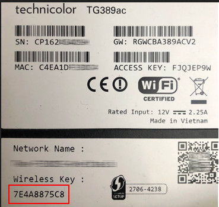
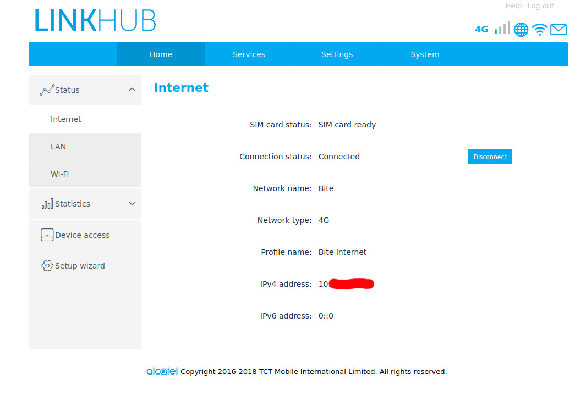
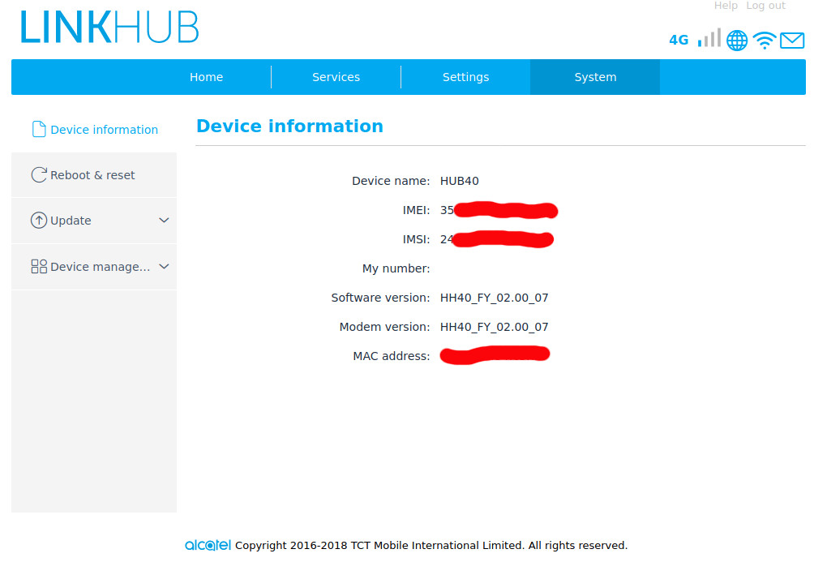
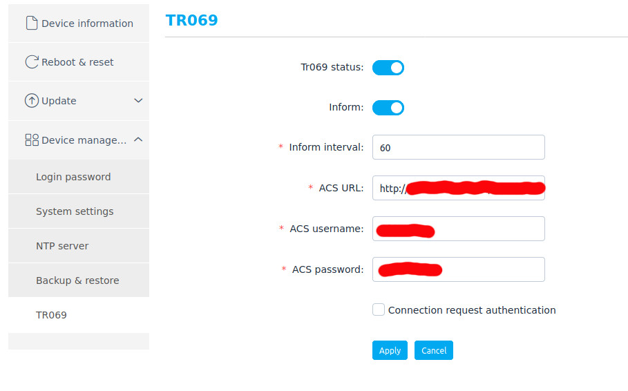
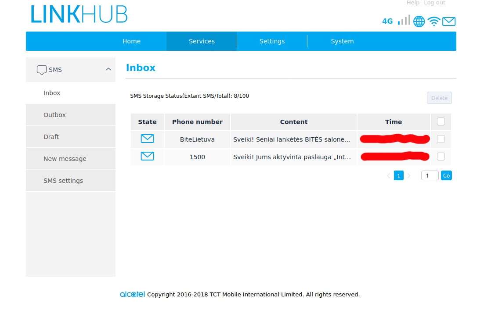

# FDEU-CVE-2020-1C7E

# Summary

Vulnerable Alcatel HH40V routers still being sold by Bite Lietuva.

# Tech details

Alcatel HH40V being sold by Bite Lietuva still contains publicly known vulnerabilities that allow a remote attacker to gain root access without user notice, intercept all the traffic, send and receive SMS on behalf of the owner.

# Prologue. Recent Ministry of Defense notice about weak passwords

It has been known that many internet routers have weak default passwords. It is fairly easy to hijack a router if the default credentials are left. Notice and recommendations from MoD:

[https://kam.lt/en/news_1098/current_issues/national_cyber_security_centre_recommends_to_change_factory_passwords_on_the_wi-fi_routers.html](https://kam.lt/en/news_1098/current_issues/national_cyber_security_centre_recommends_to_change_factory_passwords_on_the_wi-fi_routers.html)

Worth mentioning, that MoD did not remove the bar codes from the screenshots, so you can still recover the blurred data. An example of a weak Telia provided router:

<pre>
serial: CP1624SADSH
mac: C4:EA:1D:F3:3D:C4
ssid: Telia-F33DC5-Greitas
wpa psk: 7E4A8875C8
admin password: FJQJEP9W
</pre>

If you find an SSID that starts with `Telia-`, `Teo-`, `Cgates-`, `Tplink-`, `Dlink-`, `DIR-`, `HH40-`, or any other ISP name or router brand name, that means that most probably WPA passphrase used is the default one - crack it!

# About Bite Alcatel HH40V

The router has LTE 4g, wifi and 2 ethernet ports. Sold for 60.99 eur without a contract.

[https://www.bite.lt/marsrutizatoriai/alcatel-linkhub-hh40](https://www.bite.lt/marsrutizatoriai/alcatel-linkhub-hh40)

We managed to find the OTA (over-the-air) incremental firmware update package for this model:

[http://g2slave-ap-north-01.tctmobile.com/1eb04dc94af92de20ee27f085822662c60ebbd7d/63/396763](http://g2slave-ap-north-01.tctmobile.com/1eb04dc94af92de20ee27f085822662c60ebbd7d/63/396763)

# Analysis of the firmware

Since we were successful in obtaining the firmware prior to the black box attack, we used this advantage and performed quick analysis of the firmware.

It remained a mystery why both ARM and MIPS code are being used at the same time (will be explained later).

Root user hash found:

`root:$1$NruLZTUe$/3U22TFuMf1q2FRqwrmUK0:17134:0:99999:7:::`

Interesting auto start application that could be a candidate for a buffer overflow (because of the use of unsafe `sprintf`):

`/usr/oem/core_app`

Overall, the firmware contained a kind of Android-like Linux image with lots of custom code from the SoC chip vendor (Qualcomm). Very boring. So we decided to try a real attack.

# Pwned in the wild

Let's start from wifi bruteforce - just a few seconds, and we got in. This was digits-only 8-symbols wifi password. Exactly like in MoD notice.

Checking the Web UI - admin password also has not been changed: `admin/admin`.

Web UI did not contain much of the settings, like SSH, but the scanner showed there was an instance of a Dropbear running on the standard port 22.

Let's bruteforce root's password hash we found using Metasploit router dictionary (routers_userpass.txt). And we are in!

Found credentials: `root/oelinux123`

Linux kernel version:

`Linux mdm9607 3.18.20 #1 PREEMPT Tue Nov 20 10:27:09 CST 2018 armv7l GNU/Linux`

Partition info:

<pre>
root@mdm9607:~# df -h
Filesystem                Size      Used Available Use% Mounted on
ubi0:rootfs              39.8M     27.4M     12.3M  69% /
tmpfs                    64.0K      4.0K     60.0K   6% /dev
tmpfs                    28.4M     28.0K     28.3M   0% /run
tmpfs                    28.4M     72.0K     28.3M   0% /var/volatile
tmpfs                    28.4M         0     28.4M   0% /media/ram
ubi0:usrfs                9.6M     24.0K      9.6M   0% /data
/dev/ubi1_0              29.0M     19.5M      9.5M  67% /firmware
/dev/ubi2_0               3.8M      1.4M      2.4M  37% /jrd-resource
/dev/ubi3_0               4.3M    240.0K      3.8M   6% /cache
/dev/ubi4_0              62.8M      2.8M     56.7M   5% /forloop
/dev/loop0               59.7M     28.0K     59.7M   0% /extern
</pre>

Open ports:

| interface | ip | open ports |
|-----------|----|-------|
| bridge0 | 192.168.225.1 | 22,23,53,80,2016,5037,5555,8888
| rndis0 | 192.168.225.111 | 53,80
| mips? | 192.168.1.1 | 53,80
| rmnet_data0 | 10.x.x.x | 22,23,80,5555
| external? | 84.x.x.x | ?

Interesting device!

Searching on the internet for "oelinux123" and "mdm9607"... - surprise, surprise!

# Known vulnerabilities since 2018

It turned out the root password leaked back in 2018!

`CVE-2018-10532` for a similar model `HH70`:

[https://blog.jameshemmings.co.uk/2018/10/24/4gee-hh70-router-vulnerability-disclosure/](https://blog.jameshemmings.co.uk/2018/10/24/4gee-hh70-router-vulnerability-disclosure/)

Searching further we found a wiki page with lots of collected info:

[https://github.com/froonix/HH40V/wiki](https://github.com/froonix/HH40V/wiki)

Now that explains why we have seen both ARM and MIPS executables in the firmware. There are two separate platforms inside this router: ARM 4g modem and MIPS wireless hotspot. Two platforms are connected over USB network interface (RNDIS) and communicate using a socket (`core_app` executable).

The current firmware contains a mitigation only for `CVE-2018-10532`: dropbear is disabled on the wifi platform system. But we still have network access to it from the modem system, so it may be possible to exploit `core_app` to get access to the MIPS SoC systems. Anyway, root access on the modem system is more important, as you can control all the outbound traffic, not just wifi.

# Persistent backdoor

There are two strategies of getting a persistent backdoor.

## Writable firmware partition

The `/jrd-resource` partition contains lots of executable scripts and it is mounted as read/write. So it is quite a good place to download the second stage exploits and install a persistent backdoor. However, this would not survive a firmware upgrade if that ever happened.

## TR069

The device supports a CPE management interface called "TR069", so the more advanced way to keep a backdoor would be to supply a malicious TR069 server. In this case the settings would be kept after an OTA update. 

# Send SMS on behalf of the owner

The Web UI allows you to send, receive and delete SMS:

This can be abused by using premium numbers or registering paid services.

# Timeline

* 2020-07-29 - analysis of the firmware performed
* 2020-07-31 - multiple devices have been pwned in the wild
* 2020-08-05 - reported to Bite
* 2020-09-01 - disclosure reminder sent
* 2020-09-03 - Bite confirmed this was Alcatel's and users' problem
* 2020-09-16 - full disclosure

