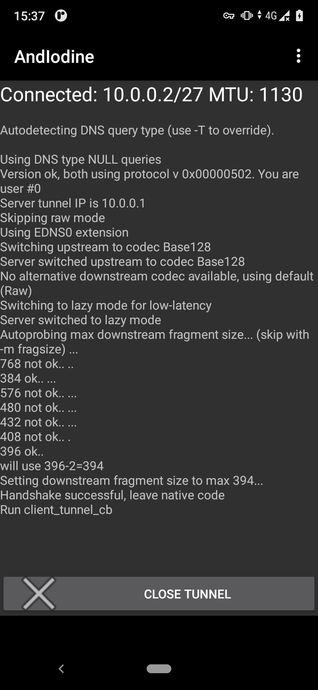

# FDEU-CVE-2021-30F0

# Summary

Bypass of mobile internet restrictions.


# Tech details

Mobile internet providers use insufficient internet traffic restrictions that can be
bypassed using DNS tunneling to gain free internet without paying for an interent plan.


# Mobile internet providers

We have checked the two biggest prepaid mobile internet providers in Lithuania: Bite Labas and Tele2 Pildyk.
Both providers allow to order an internet plan via a selfservice web page and inject traffic restrictions
when the user has not paid for an internet plan.

Bite blocks all addresses except the selfservice server, where the user can log in and pay for the internet plan.
In the following log snip you can see that an external address could not be pinged,
but the selfservice address is answering to ping requests:

```
$ ping tele2.lt
PING tele2.lt (90.131.23.75) 56(84) bytes of data.
^C
--- tele2.lt ping statistics ---
2 packets transmitted, 0 received, 100% packet loss, time 1006ms

$ ping mano.labas.lt
PING mano.labas.lt (213.226.139.76) 56(84) bytes of data.
64 bytes from 213.226.139.76: icmp_seq=1 ttl=251 time=48.9 ms
64 bytes from 213.226.139.76: icmp_seq=2 ttl=251 time=55.8 ms
^C
```

Tele2 does transparent TCP 80 and 443 redirect to the selfservice server, which may look like a Man-in-the-middle attack.
In the following log snip you can see that neither external, nor the selfservice address responded to ping,
however when tried to access an external web service - the connection was redirected to the selfservice server:

```
$ ping mano.labas.lt
PING mano.labas.lt (213.226.139.76) 56(84) bytes of data.
^C
--- mano.labas.lt ping statistics ---
7 packets transmitted, 0 received, 100% packet loss, time 5999ms

$ ping mano.pildyk.lt
PING mano.pildyk.lt (90.131.23.51) 56(84) bytes of data.
^C
--- mano.pildyk.lt ping statistics ---
7 packets transmitted, 0 received, 100% packet loss, time 6007ms

$ wget -O - http://mano.labas.lt
Connecting to mano.labas.lt (213.226.139.76:80)
Connecting to narsyk2.pildyk.lt (90.131.23.51:80)
<html class="no-js " lang="en">
<head>...
...
```


# About DNS tunneling

You may have noticed in the ping command output above, that both operators still allow DNS to be resolved:

```
mano.pildyk.lt -> 90.131.23.51
mano.labas.lt -> 213.226.139.76
```

When internet connection activates on the phone, the remote server provides two DNS addresses to the client,
no matter if there is an active internet plan or not:

```
Bite:
213.226.131.131
193.219.88.36
```
```
Tele2:
193.12.150.64
212.247.152.64
```

We found that those servers are recursive: they are able to query an upstream authoritative DNS server even
when the user has not paid for an internet plan. The easiest way to prove that is to query Cloudflare ESNI key.
For example:

```
$ nslookup -type=TXT _esni.cloudflare.com 213.226.131.131
Server:		213.226.131.131
Address:	213.226.131.131:53

Non-authoritative answer:
_esni.cloudflare.com	text = "/wHDTmk5ACQAHQAg06otXpt4uBemsyv/Q2VhhRRG7pKXzDQn3wNvlcJAVSAAAhMBAQQAAAAAYMxgkAAAAABg1EmQAAA="
```

In this example our DNS request reached the external Cloudflare DNS and we were able to fetch an ESNI key
(that long base64 value). This means that there is a bidirectional connection to an external DNS that we
could use to bypass the internet restriction.

To exploit DNS tunneling we need an internet-facing machine that will host Iodine software. We also need a
domain name that we could control (we took a random name for $1 for the test). After all was set up we were
able to establish DNS tunneling on bot Bite and Tele2 networks without an active internet plan.


# PoC

For the test we used an Android phone with AndIodine app:



For both operators we paid for a weekend-only internet plan. On Monday internet access was restricted by both operators.
The same day AndIodine was used to bypass the restrictions. The internet worked fine through the day.
It worked extremely slowly, but good enough for messaging apps and news reading.


| Mobile operator | Vulnerable? | Fixed? |
|-----------------|-------------|--------|
| Bite Labas      |    yes      |   no   |
| Tele2 Pildyk    |    yes      |   no <sup>1</sup>  |
| Telia           |  opt-out <sup>2</sup>   |   -    |

<small><sup>1</sup> Tele2 informed that they have an active monitoring of such abuse case.<br>
<sup>2</sup> In 2019 Telia tried to attack one of our researchers for a responsible disclosure of a vulnerability.</small>


# Timeline

<pre>
2021-07-07 - initial research and poc
2021-07-08 - sent report to Bite and Tele2
2021-09-28 - sent a disclosure deadline notification
2021-09-29 - got a response from Bite asking: what report? which disclosure?
2021-10-05 - got a response from Tele2 that all DNS traffic was being monitored to prevent any abuse
2021-11-12 - full disclosure

</pre>
