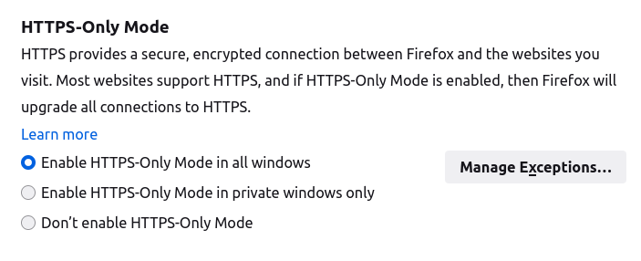
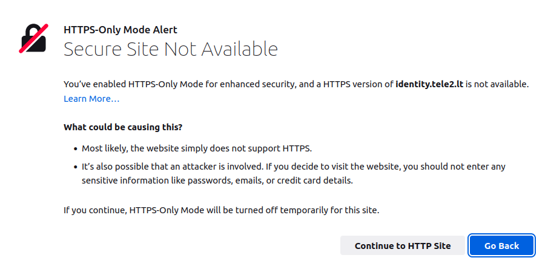

# FDEU-CVE-2022-41c0

# Summary

Tele2 again incorrectly using HTTPS on its self-service website.

# Tech details

Some web services still incorrectly configure HTTPS which may result in protocol downgrade vulnerability
and allow attackers to intercept plain HTTP requests.

# Vulnerability

When a user tried to open a self-service website of Tele2 - `https://mano.tele2.lt` - there was a redirect
to an identification endpoint - `https://login.tele2.lt`. Which in turn performed another redirect:

<pre>
$ curl -v GET https://login.tele2.lt/login?ReturnUrl=

< HTTP/2 307
< content-type: text/html; charset=UTF-8
< location: http://login.tele2.lt/?cn1=xxxx
< vary: Accept-Encoding
< access-control-allow-origin: *
< access-control-allow-headers: Content-Type
< access-control-allow-methods: GET, POST, PUT, DELETE, OPTIONS
< x-content-type-options: nosniff
< x-content-security-policy: default-src 'self'
< x-frame-options: DENY
< date: Fri, 20 Aug 2021 xxxx
< content-length: 279
</pre>

Notice, that the new location is `http://login.tele2.lt` - it is a plain HTTP endpoint without transport encryption.
With this issue the entire (later) encryption is defeated. If a user is connected from an untrusted network,
the HTTP request could be intercepted and, ex, a phishing login form prompted.

Also notice, the curl example is from 2021. This issue has been privately disclosed as a misconfiguration.

# The issue is back in 2022

In 2022 we noticed the same behavior. This time user was being redirected to:

`http://identity.tele2.lt/?cn1=xxxxx`

A new domain, but still the old issue.

# Firefox feature to force HTTPS

How did we notice that? Thanks to Firefox browser which has an option to detect HTTP downgrade since version 83:

[https://blog.mozilla.org/security/2020/11/17/firefox-83-introduces-https-only-mode/](https://blog.mozilla.org/security/2020/11/17/firefox-83-introduces-https-only-mode/)

When visited `https://mano.tele2.lt`, Firefox users would get this warning:

We recommend to use Firefox with this feature enabled to prevent HTTP redirect attacks.

# Why still HTTP?

Why would we write an entire article about simple HTTPS misconfiguration?

Because it is 2022 and there is `Lets Encrypt` project that simplifies usage of HTTPS everywhere and costs nothing.
There is no excuse to still use HTTP on the internet. However, it is still an issue in 2022. Why?

We have another example that shows how challenging it may be for some vendors to detect such misconfiguration.

# Bonus - Atlassian

Take a look at this HTTPS request:

<pre>
$ curl -v "https://bugbounty-test.atlassian.net/login.jsp?os_destination=%2Fbrowse%2FNA&permission-violation=true"
*   Trying 18.184.99.128:443...
* TCP_NODELAY set
* Connected to bugbounty-test.atlassian.net (18.184.99.128) port 443 (#0)
* ALPN, offering h2
* ALPN, offering http/1.1
* successfully set certificate verify locations:
*   CAfile: /etc/ssl/certs/ca-certificates.crt
  CApath: /etc/ssl/certs
* TLSv1.3 (OUT), TLS handshake, Client hello (1):
* TLSv1.3 (IN), TLS handshake, Server hello (2):
* TLSv1.3 (OUT), TLS change cipher, Change cipher spec (1):
* TLSv1.3 (OUT), TLS handshake, Client hello (1):
* TLSv1.3 (IN), TLS handshake, Server hello (2):
* TLSv1.3 (IN), TLS handshake, Encrypted Extensions (8):
* TLSv1.3 (IN), TLS handshake, Certificate (11):
* TLSv1.3 (IN), TLS handshake, CERT verify (15):
* TLSv1.3 (IN), TLS handshake, Finished (20):
* TLSv1.3 (OUT), TLS handshake, Finished (20):
* SSL connection using TLSv1.3 / TLS_AES_128_GCM_SHA256
* ALPN, server accepted to use h2
* Server certificate:
*  subject: C=US; ST=California; L=San Francisco; O=Atlassian Network Services, Inc.; CN=*.atlassian.net
*  start date: Nov 28 00:00:00 2019 GMT
*  expire date: Jan 18 12:00:00 2022 GMT
*  subjectAltName: host "bugbounty-test.atlassian.net" matched cert's "*.atlassian.net"
*  issuer: C=US; O=DigiCert Inc; OU=www.digicert.com; CN=DigiCert SHA2 High Assurance Server CA
*  SSL certificate verify ok.
* Using HTTP2, server supports multi-use
* Connection state changed (HTTP/2 confirmed)
* Copying HTTP/2 data in stream buffer to connection buffer after upgrade: len=0
* Using Stream ID: 1 (easy handle 0x5569ac33ee10)
> GET /login.jsp?os_destination=%2Fbrowse%2FNA&permission-violation=true HTTP/2
> Host: bugbounty-test.atlassian.net
> user-agent: curl/7.68.0
> accept: */*
> 
* TLSv1.3 (IN), TLS handshake, Newsession Ticket (4):
* Connection state changed (MAX_CONCURRENT_STREAMS == 200)!
< HTTP/2 302 
< server: AtlassianProxy/1.19.3.1
< vary: Accept-Encoding
< content-type: text/html
< strict-transport-security: max-age=315360000; includeSubDomains; preload
< date: Fri, 27 Aug 2021 07:07:52 GMT
< atl-traceid: e785604d8d98abd6
< location: http://bugbounty-test.atlassian.net/login?application=jira&dest-url=%2Fbrowse%2FNA
< x-xss-protection: 1; mode=block
< x-envoy-upstream-service-time: 0
< x-content-type-options: nosniff
< expect-ct: report-uri="https://web-security-reports.services.atlassian.com/expect-ct-report/global-proxy", enforce, max-age=86400
< content-length: 138
< 
&lt;html&gt;
&lt;head&gt;&lt;title&gt;302 Found&lt;/title&gt;&lt;/head&gt;
&lt;body&gt;
&lt;center&gt;&lt;h1&gt;302 Found&lt;/h1&gt;&lt;/center&gt;
&lt;hr&gt;&lt;center&gt;nginx&lt;/center&gt;
&lt;/body&gt;
&lt;/html&gt;
</pre>

Note this response header:

`location: http://bugbounty-test.atlassian.net/login?application=jira...`

The issue is pretty clear. We can see protocol downgrade from HTTPS to HTTP.

However, when the issue was reported to Atlassian through the bug bounty program, a "highly skilled" technical
triage team of Bugcrowd closed the report as "Not applicable" because:

<pre>
Thank you for your submission.
However, the application is redirecting to HTTPs,
as such, this doesn't pose any security concern!
</pre>

How could it be possible that "highly skilled" technical triage team did not see the `Location` header? Simply, they used Chrome!
When that link was being opened in Chrome (or Firefox with disabled "HTTPS-Only Mode" option), all the user could see was
the final page being HTTPS. Here, I open HTTPS, I see a loaded page with HTTPS prefix in my browser, there is no security concern!

If only Bugcrowd triage team could know how to open a `Developer console` of the browser, they could see,
how a typical landing process works in Atlassian's Jira:

The browser did two requests here. The first one had a redirect to HTTPS. Then, the second one, had redirect to HTTP.
And at that point Firefox stopped and showed a warning. However, Chrome would follow that HTTP link, which in turn
redirects back to HTTPS (not always, but both Tele2 and Atlassian redirect to HTTPS from there).
That's why the last page looked safe. And if you don't follow the developer console, you would think that only HTTPS was involved here.

P.S.: Atlassian fixed the issue after it was reported directly to technical support channel.

# Conclusion

Use Firefox with "HTTPS-Only Mode" setting and avoid using Bugcrowd as a bugbounty platform for your products.

# Timeline

<pre>
2021-08-20 - initial private disclosure to Tele2
2021-10-22 - issue fixed (cmon, two months was too much)
2022-01-04 - the issue was back
2022-01-17 - the issue fixed again
2022-05-26 - full disclosure
</pre>
