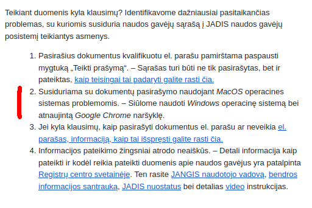
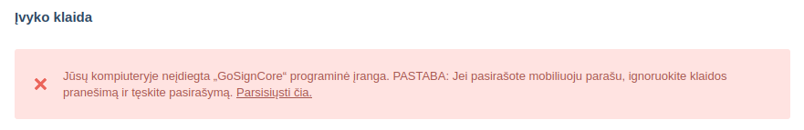
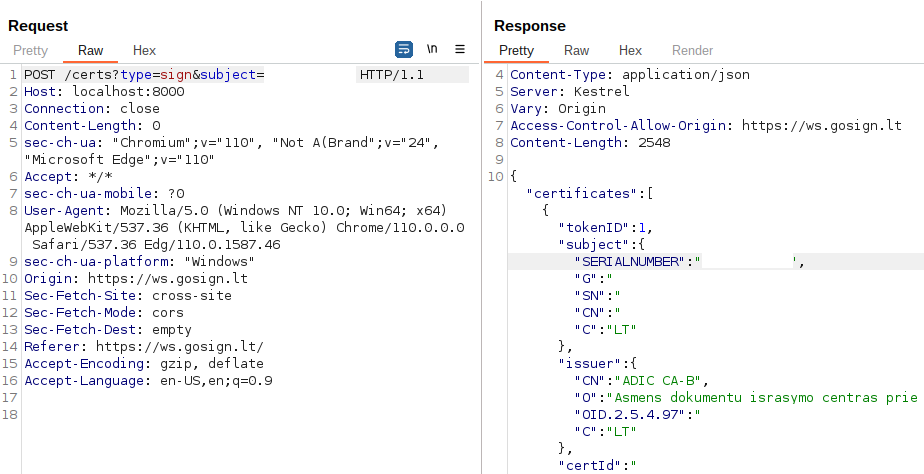
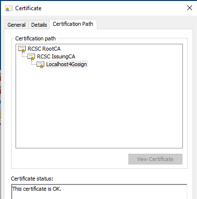
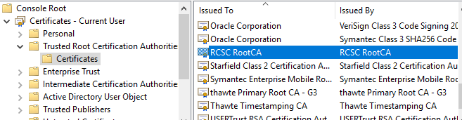
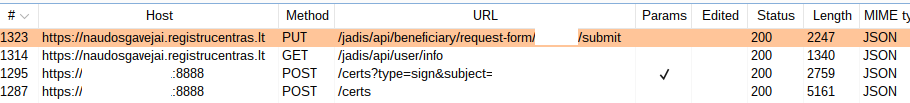

# FDEU-CVE-2023-60ab

# Summary

Registru Centras GoSign digital signature middleware insecure architecture.

# Tech details

Registru Centras GoSign digital signature middleware installs a custom CA, a local web server without authentication and uses an
insecure way of entering PIN and signing documents allowing signature to be done fully remotely without user's interaction.

# About GoSign

Registru Centras (RC) is a state owned company in Lithuania that holds real estate, addresses, company (legal entity) and other
important registry ([https://www.registrucentras.lt/](https://www.registrucentras.lt/)).
It is also an official provider of a qualified digital signature in Lithuania ([https://www.elektroninis.lt/en](https://www.elektroninis.lt/en)).
In order to provide its user an ability to sign documents online, RC created a GoSign product - [https://www.gosign.lt/en/](https://www.gosign.lt/en/).
There are similar tools like Signa Web or Dokobit that allows user to sign documents in-browser with some minimal middleware installed.
While Signa Web and Dokobit support ID card (ATK) on multiple OS and browsers and do not require admin rights (browser extensions),
RC GoSign is a Windows-only MSI package ([msi](https://www.elektroninis.lt/bylos/elektroninis_lt/Diegliai/GoSignCore.msi)) that can only be installed by administrator.
MobileID signature is out of scope of this article.

# Government's requirement

Starting from 2022 there is a requirement for any Lithuanian company to provide the list of beneficial owners.
And that form can be only filed using an RC online service called JANGIS: [https://www.registrucentras.lt/jangis-en/](https://www.registrucentras.lt/jangis-en/).
Since Full Disclosure is a non-profit organization registered in Lithuania, we also received a request to provide beneficiary list:

<pre>
There were issues signing documents using the MacOS operating system.
We recommend using Windows with the latest Chrome browser
</pre>

MacOS issues? Yeah, how do we install an MSI package on our fancy new arm macbooks? Linux is not even mentioned as an option.

The goal of JANGIS was to simplify the process and make data well-structured to meet up to date digital world requirements.
However, whenever a state-owned company tries to develop an IT product, the application security budget is usually very limited or absent completely.

# Previous findings

* Sec-Consult:  [https://sec-consult.com/blog/detail/deanonymization-of-lithuanian-e-signature-users/](https://sec-consult.com/blog/detail/deanonymization-of-lithuanian-e-signature-users/)
* DevSecurity: [https://blog.devsecurity.eu/en/blog/registru-centras-gosign-vulnerabilities](https://blog.devsecurity.eu/en/blog/registru-centras-gosign-vulnerabilities)

Well done high level overview. Lets complement it with more low level details.

# Low level design

## Unsigned data, signed PDF

The data that users fill into JANGIS web form is saved in some structured format on the server side (database, json or xml),
after that a PDF is generated out of this data and the user must sign this PDF using the GoSign tool. The first issue here is
that the structured data remains unsigned, only generated PDF gets signed. This allows system administrators
to alter data stored in the database while PDF stays signed, but the data will not match anymore.
Also, we doubt that there is an easy way to verify that data in the database matches the data in the PDF
(we did some freeware pdf-to-text conversions of the downloaded PDF and the results were very poor).

## Web server

GoSign installs a local web server that listens on `127.0.0.1:8000` and has no authentication. Any local process is able to connect to it and use it's API:

There is CORS to protect against the requests coming from a legit browser.
We will cover a case when there is a local unprivileged process that is able to access the service, so, CORS are not relevant at the moment.

## Custom CA

The web server is using a certificate issued to `CN=localhost` and the CA is "RCSC RootCA":

This certificate is added into the Trusted store during installation.
At this point RC may issue any rogue certificate and perform man-in-the-middle attacks against you.

## Certificate

The private key of the "localhost" certificate is protected by the password:

`Kada123`

With this certificate you can host your own local server with a locally trusted certificate.

## PIN entry

Common practice of digital signature middleware is to use card's middleware to prompt for the PIN.
The same way we enter the PIN of our bank card through the terminal's keyboard: the merchant does not get access to your PIN.
However, there is still another developer-convenient way of signing data by providing the PIN together with the request.
GoSign does that too, meaning that the user must enter his PIN on the web site.
In this case the RC developers or any web extension you already have (ex, AdBlock) may know your PIN.

## DoS the card

The web server's API has no authorization or throttle which allows a malicious app to send many invalid PIN requests which would block your smart card permanently.

## PoC of remote signature

After getting all together our goal was to sign JANGIS form using a MacBook while being 100 km away from the card.
The only requirement was to have a low privileged process already running on the system where GoSign is installed.

To run Windows code on MacBook we used VirtualBox with a USB pass-through extension. This allowed us to install GoSign and access the card.
After that we used a simple "netcat" command line tool to establish a reverse connection between a remote "attacker" machine and the web server on port 8000.
Then the other MacBook took a train from Kaunas to Vilnius (100 km away) and successfully signed the JANGIS form while being physically far away from the ATK smart card.

# Conclusion

No critical findings have been found or reported to the vendor as we have very little interest in some random proprietary Windows software.
And the rest of the findings are already known since 2020.
But here are some recommendations if you are required to use GoSign:

1. avoid using GoSign.
2. if you are a company owner and you must use GoSign with ATK - only insert the card when you are signing and remove the card immediately after you are done.
3. if possible, uninstall GoSign after you no longer need it and remove the RCSC CA certificate from the system store.

# Timeline

<pre>
2023-01-03 - got email reminder about the obligation to use GoSign
2023-01-13 - initial research started
2023-03-09 - got confirmation from RC that this Windows-only program is indeed mandatory for ATK owners
2023-04-24 - full disclosure
</pre>
