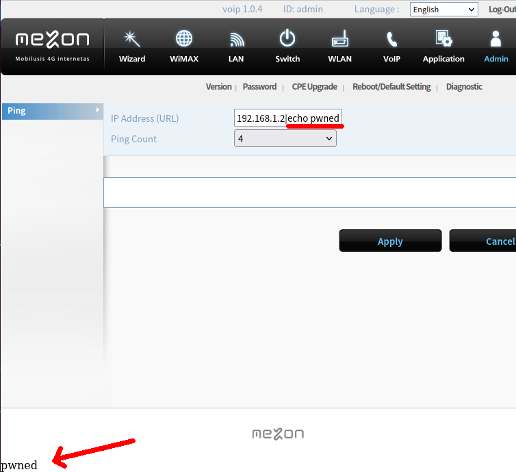

# FDEU-CVE-2023-77dc

# Summary

Mezon SWC-9200 router is vulnerable to remote code execution.

# Tech details

Mezon SWC-9200 router contains unauthenticated remote code execution vulnerability that can be triggered by injecting
arbitrary shell commands into an HTTP parameter of Diagnostics.cgi endpoint. Additionally, it has an SSH server running
on custom port 5000 that allows root login with a hardcoded password which is the same for all devices.

# About Mezon

Mezon was a brand of WiMAX provider in Lithuania by LRTC (Lithuanian Radio and Television Centre). Users could use either
USB modems or white label (Seowon) routers with Mezon brand. In 2018 the WiMAX (also sometimes called 3.5G) network was
shut down and Mezon switched to LTE. In 2020 Bite acquired Mezon for 20M euros.

# SWC-9200

The router has: Mediatek ARM processor, WiMAX modem, network switch (2 LAN ports), RJ-14 phone socket and 2.4 ghz wifi.
Unfortunately, we have been late to the party and got access to the router in 2023 after its WAN uplink had been already not functional.
But it is still available on the second-hand aftermarket:

https://www.skelbiu.lt/skelbimai/modemai-45040675.html

# Random reboots

Before we move to the vulnerabilities, one thing that needs to be mentioned, is how hard it was to attack the device, that reboots
every 5 minutes. We thought it was some kind of hardware malfunction and were about to give up. But later we figured out,
it was a "watchdog" script that kept rebooting the device because of WiMAX unavailability:

<pre>
#!/bin/sh
#################################################################################
# created by TOTC xxxx xxxx x.xxxxx@lrtc.lt
# (v0.1). Modified and adapded fo SWC-9200 by TOTC z.zzzzz@lrtc.lt
#################################################################################
PERIOD=120
OUT_OF_COVERAGE_TIME=30
STARTUP_TIME=60

### palaukiame, kol CPE startuos ir prisijungs prie WiMAX tinklo

sleep $STARTUP_TIME

### paleidziame watchcat'a

while true
	do
	GW=`ip route list | grep default | awk '{print $3}'`

	# tikriname ar CPE turi default gw
	if [ "x$GW" != "x" ]; then
		ping -c 3 $GW 1>/dev/null 2>&1
		else
		# default GW nerastas rebootiname CPE
		reboot
	fi
	RC=$?
</pre>

Thanks guys, who wrote that script, you really made our job harder.

# RCE

The web UI of the router has a Diagnostics page which allows to send `ping` command.
Pretty quickly an RCE has been discovered:

What was more surprising is that this page was available without authentication.
You could send a direct HTTP request to `/cgi-bin/diagnostic.cgi` endpoint to execute the code.

Using a tiny 1-minute window between reboots we made a full flash dump and started analyzing it.

# Root access

Another issue that came very quickly was SSH server running on port 5000. It refused the default `admin` password.
It also refused to accept the root's password from `/etc/shadow` which was `wimax`.
After doing the reverse engineer of the firmware we found that the custom shell `cli.elf` had a hardcoded root password:

`t}PXbq|E`

The password is hardcoded in the firmware. And the SSH instance is bind to `0.0.0.0:5000`. That means,
if the firewall rules allow remote access to that port, every SWC-9200 can be compromised not only
by triggering RCE from LAN, but also by connecting as root remotely.

# Some info

<pre>
# cat /proc/cpuinfo
Processor	: ARM926EJ-S rev 5 (v5l)
BogoMIPS	: 184.72
Features	: swp half thumb fastmult edsp java
CPU implementer	: 0x41
CPU architecture: 5TEJ
CPU variant	: 0x0
CPU part	: 0x926
CPU revision	: 5
Cache type	: write-back
Cache clean	: cp15 c7 ops
Cache lockdown	: format C
Cache format	: Harvard
I size		: 32768
I assoc		: 4
I line length	: 32
I sets		: 256
D size		: 32768
D assoc		: 4
D line length	: 32
D sets		: 256

Hardware	: MT7108
Revision	: 0000
Serial		: 0000000000000000

# cat /proc/mtd
dev:    size   erasesize  name
mtd0: 00040000 00040000 "Redboot"
mtd1: 01600000 00040000 "etc_plus"

# netstat -atn
Active Internet connections (servers and established)
Proto Recv-Q Send-Q Local Address           Foreign Address         State
tcp        0      0 0.0.0.0:5060            0.0.0.0:*               LISTEN
tcp        0      0 0.0.0.0:4004            0.0.0.0:*               LISTEN
tcp        0      0 0.0.0.0:6789            0.0.0.0:*               LISTEN
tcp        0      0 0.0.0.0:5000            0.0.0.0:*               LISTEN
tcp        0      0 0.0.0.0:2601            0.0.0.0:*               LISTEN
tcp        0      0 0.0.0.0:9999            0.0.0.0:*               LISTEN
tcp        0      0 0.0.0.0:80              0.0.0.0:*               LISTEN
tcp        0      0 0.0.0.0:17109           0.0.0.0:*               LISTEN
tcp        0      0 0.0.0.0:1723            0.0.0.0:*               LISTEN
tcp        0      0 0.0.0.0:17119           0.0.0.0:*               LISTEN
tcp        0      0 192.168.1.1:5000        192.168.1.2:37790       ESTABLISHED
</pre>

# Timeline

<pre>
2023-05-30 - requested MITRE CVE (no answer)
2023-05-31 - pinged Bite if the router is still supported
2023-06-01 - got answer from Bite that routers are out of bug bounty scope,
             but asked for details for free
2023-06-02 - sent executive summary
2023-06-12 - got confirmation from Bite that router is EOL and WiMAX network is down,
             users and company are not affected
2023-06-15 - pinged MITRE if CVE has been assigned (no answer)
2023-06-19 - full disclosure
</pre>
