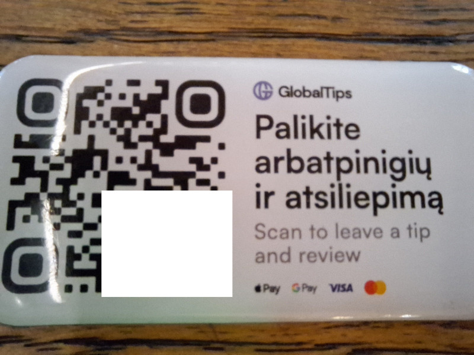

# FDEU-CVE-2024-8ab4

# Summary

Globaltips using unprotected writable NFC cards.

# Tech details

Globaltips has developed a system to leave tips without cash - by scanning a URL from an NFC card. Some cards have been left unprotected and writable, which could allow anyone to overwrite it with a malicious link.

# About Globaltips

Globaltips is a company registered in Lithuania that offers various services for restaurants, including QR-code menu or NFC tips. Globaltips is one of tech companies that offers a solution for restaurants to collect cashless tips.

# Main challenges of tips

One of the biggest challenges for the restaurants is that a lot of people do not carry cash anymore or don't have coins to leave small tips. People got used to tap-and-pay or payments through the app. Because of that, the business naturally started to look for a technical solution to allow customers to leave tips without cash. In Lithuania it is a challenge, because you can't simply charge an extra amount through the same card payment terminal. And it would be too expensive for every waiter to have their own terminal.

This demand created new tech companies that offer a solution: leave tips by bank card. Usually the solution includes a QR code sticker or an NFC card that the customer needs to scan in order to get the magic URL that would open some sort of web ui to complete the payment.

Now the challenge of not having cash has been shifted to another challenge: would a customer be able to securely transfer the desired amount to the particular person who served the food?

## Problem: correct tips receiver

When you leave tips the old way, using cash, you are 100% sure that you paid your waiter. But in case of bank card payment, the funds are received by an intermediary. There is no guarantee what exact amount the waiter gets. We couldn't find the pricing on Globaltip's website. It could be 80%, or maybe 40%, or maybe 10%. And it is not clear how and who pays taxes.

There was an attempt to establish trust by adding profile photos:

Only one photo can be identified. Julius has no photo, you won't pay a penny to a black cat, and we all know that Kasparas is a hacker.

## Problem: secure and easy payment

So, you decided that the black cat is trustworthy and you clicked on the URL. You are presented with either a classic credit card form or a login to your bank. Nobody likes to enter credit card details on a random website and in a hurry, that way we often get scammed:

Based on your phone browser's User-Agent you may also get an option to pay through Google Pay or Apple Pay. Which is faster and safer as there are less chances that your card details or bank session will leak to scammers. But at the time of writing Android Firefox 124.2.0 was not getting that option, even though Google Pay has been configured on the device.

## Problem: QR code authenticity

QR code is easy to replace and spoof. Anyone can encode his own URL and replace it. You can't tell from a first sight which QR code is legit and which is fake. Partially this can be mitigated by providing high quality fancy stickers that can't be made easily at home. This one really looks trustworthy, doesn't it:

But the problem is that you can still peel it off and stick your own fake:

Nobody knows how the correct one looks like, there is no standard. Any will look legit except black and white laser-printed on an office paper and glued with adhesive tape and with a text "haha pwned".

There is a mitigation - QR code brought by the waiter on a fiscal receipt:

This way you know that the QR is legit and comes from the waiter. Unfortunately, this is a very unpopular solution in Lithuania because of restaurants cheating with taxes (low chances you will get a fiscal receipt at all).

## Problem: NFC card (a safer alternative?)

Probably, the idea was that an NFC card is harder to spoof, because the card needs to have a logo printed on it and it is fixed at the bar or brought by the waiter:

NFC card is not a payment terminal that you can simply tap your phone and you are done. No, it contains the same URL. When you tap your phone, the default browser will open a web view tab and load the URL from the card:

NFC cards are very cheap, can be ordered online and even have a print of a logo on it, so it will look legit, but contain a malicious URL. They are not so different from QR codes.

But even if the card is glued to the bar stove with the super glue and there is no way to remove it, there is another issue. A card can be simply rewritten with a smartphone. You simply tap the phone and it will change the URL on the card. So the next customer who tries to leave tips will get to a malicious web site.

Note the difference - the previous card above is protected, while this is writable:

Anyone can download a free app and overwrite the card with a malicious link to steal tips from the waiter.

In order to protect the card, the writing software uses a passcode to lock the card so it cannot be overwritten without providing that code. And actually, Globaltips did not need to replace the cards, but simply lock them. There are free apps available on Android that allow you to manage NFC tags and cards, any waiter could fix his issued card in just a few seconds.

While pub crawling in Kaunas, we found that every second card was writable. Somehow that doesn't match Globaltip's statement that only 2% of cards are affected.

If you are a restaurant owner or a waiter, lock your Globalitps NFC card asap.

# Timeline

<pre>
2023-09-01 - initial research
2023-09-08 - contacted Globaltips
2023-09-09 - Globaltips responded that the problem is known, card replacement ETA is EOY
2024-01-19 - contacted Globaltips again for confirmation
2024-01-19 - Globaltips responded that they need 2 months more to finish
2024-04-22 - full disclosure
</pre>

