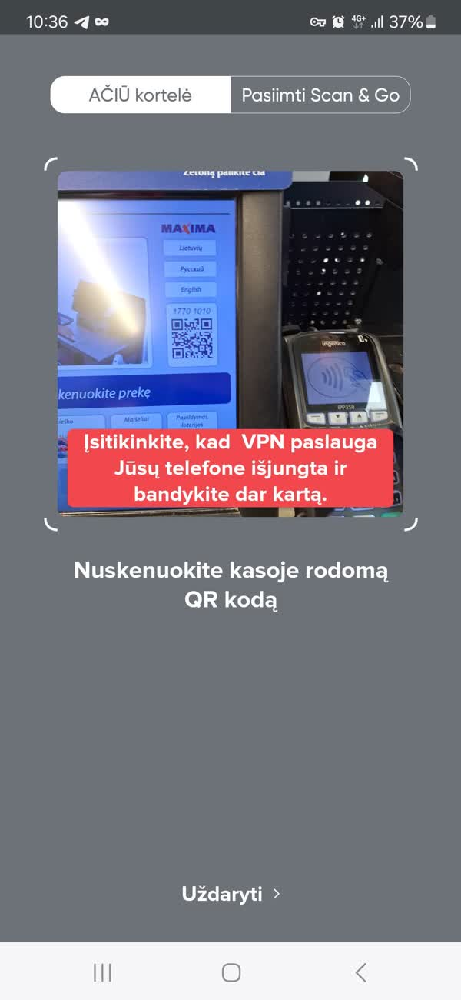
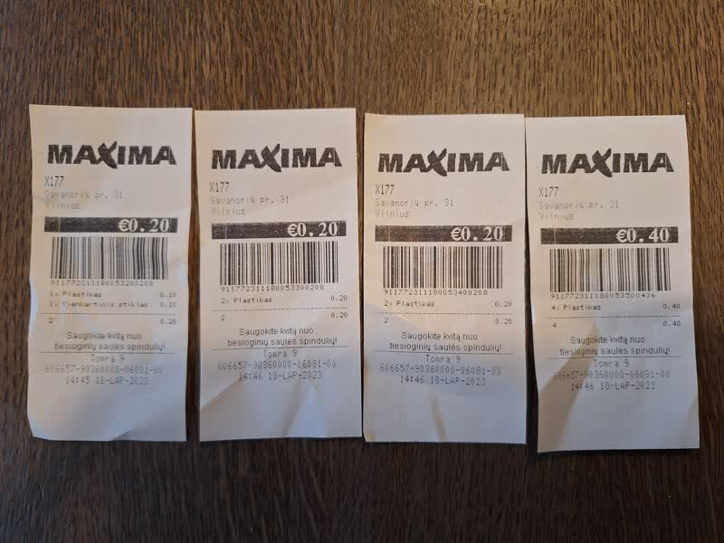
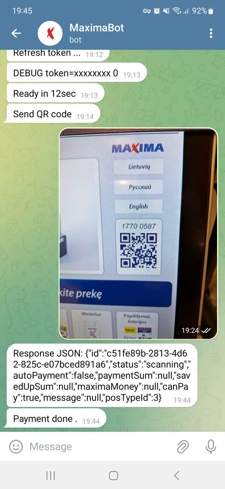

# FDEU-CVE-2024-97cb

# Summary

Maxima Android app multiple vulnerabilities.

# Tech details

Maxima Android app has not implemented sufficient token protection which allows a third party to build a custom client for direct payment API usage. Additionally, multiple weaknesses in account and biometrics management allows an account take over.

# How it started

Using a mobile app nowadays is more convenient than carrying a plastic discount card, so we gave it a try. And the first screen we got was an error asking to disable the VPN. That was disgusting. That was a red flag shouting "I will spy on you!". So we decided to dig deeper and see what was inside the app.

# About Maxima app

Most of the grocery stores offer an app equivalent of a discount card with just showing a barcode or qr code. However, Maxima went a different way. Instead of the cashier machine reading a barcode from your phone, Maxima reversed the process: the cashier machine generates a one-time-use qr code which must be scanned by the phone's camera.

When you are using VPN, the qr code activation fails, because of the phone unable to reach the API service. That is the drawback of the complicated architecture with reversed client identification, which requires both parties to have internet access.

The app also offers a mobile payment feature. After adding the credit card details to your profile, you can scan the qr code on the cashier machine, press the button in the app and the cart will be paid. You must also confirm the payment with a PIN or biometrics, but we will show later that these confirmations can be bypassed.

# Token in logs

We started investigating the app contents from the file system and immediately discovered a debug log file left in the internal storage (the app has Android permission WRITE_EXTERNAL_STORAGE): `applog.html`. It was in HTML format and contained all the web requests and responses. The requests contained an authentication token. The API backend was: [https://api.rtyui.eu](https://api.rtyui.eu).

Interestingly, the token is generated before the authentication and is only "activated" later through an SMS code flow. This process can be also vulnerable to session fixation.

All the following vulnerabilities will assume that the token is already available to an attacker.

# Biometrics bypass

After activating the account using a phone number and an SMS code, the user is prompted to create a 4 digit PIN code and fingerprint.

The biometrics code is not using any cryptography and can be bypassed on the client side by overriding (hooking) the system method "onSuccess" (ex, frida). We recommended Maxima to follow the official Android example which explains how to involve cryptography to prevent client side bypass:

[https://developer.android.com/codelabs/biometric-login#2](https://developer.android.com/codelabs/biometric-login#2)

# PIN bypass and account takeover

In order to bypass the PIN protection an attacker can simply request to change the phone number. To do that:

1. Send request to initiate phone number change to `/api/v1/profile/confirmation`;
2. A confirmation code will be sent via SMS to the new phone number;
3. Send another request to `/api/v1/profile/change-login` to confirm the phone number change with the received code;
4. The phone number has now been changed.

Now you can initiate PIN change through "Forgot my PIN" flow and fully take over the account (including credit card payment method).

# Unlock third-party loyalty card

The UI of the app does not allow you to reach the phone changing feature when the loyalty card is blocked. However, using the `/api/v2/loyalty-cards/block` API directly would allow you to bypass the restriction and unblock any card. Then use the previous vulnerability to change the phone number and take over that account.

# Brute-force Tomra deposit voucher codes

One of the most useful features of the Maxima app is the redeem of Tomra coupons.

Tomra is a self service deposit return machine which prints you a physical receipt. That receipt has to be redeemed in a physical store for cash or by partially paying for your cart. With the Maxima app you don't need to go to a physical store to redeem your coupon, you simply scan the barcode and the money goes directly to your loyalty card account. Very convenient.

We had to drink a lot of beer for this research :) In order to reverse engineer Tomra codes we returned various amount of bottles to different Tomra machines near different Maxima stores. That's a lot of coupons :)

But we got some interesting results. If you print multiple vouchers in a row you would notice that the number that is encoded in the barcode has only a few digits changing:

<pre>
911772311180053200208 - 0.20
911772311180053300208 - 0.20
911772311180053400208 - 0.20
911772311180053500406 - 0.40
</pre>

Without digging too deep into the format, you can simply predict the next number if you have the previous one. Like this:

1. Return deposit and get two vouchers in a row
2. Notice which numbers are currently changing
3. Wait until the victim completes return and prints the receipt
4. Count how many bottles the victim returned
4. Brute force the voucher code using API `/api/v1/tare/voucher/add` endpoint and claim it

The generated codes should be random, not in sequence, not predictable. But Tomra is not affiliated with Maxima and it is out of scope of this write-up. However, still, we recommended Maxima at least to rate-limit the endpoint.

One easter egg that still remains in the Maxima backend is some kind of a race condition when you try to redeem the same code simultaneosly and may randomly get HTTP status code 500. But we did not investigate further.

# Build a bot to perform unauthorized payments

Now, what is the worst thing an attacker could do with a stolen token? Probably, perform an unauthorized payment for groceries on behalf of a user. That was our goal for the PoC.

When putting together all the mentioned weaknesses, we found it is possible to take over an account and complete the purchase in a Maxima store without using the app. As a proof of concept we wrote a Telegram bot which only needed a QR code of the cashier machine to complete the payment using the victim's account. See the video below.

# PoC video

[FDEU-CVE-2024-97cb-maxima-android-video.mp4](FDEU-CVE-2024-97cb-maxima-android-video.mp4)

# Disclosure

Also worth mentioning that the initial report sent to Maxima got lost somehow. The Play Store had a generic support email provided for bug reports, where any email gets into a queue with non-technical questions. We received a standard auto response, but no follow-up. Only after we posted a video on Linkedin that went viral, Franmax reached out to us through the Linkedin personal messages. Strong advice: always keep your eye on reports, among spam and noise you may miss a real report that could hit you hard.

# Timeline

<pre>
2023-07-01 - initial research
2023-08-01 - started to drink beer every day, needed coupons for testing
2023-09-01 - printed many coupons, made brute-force PoC
2023-12-01 - PoC telegram bot with successful in-store payment
2023-12-01 - contacted Maxima through Play Store default email
2023-12-05 - after some buzz on Linkedin, got contacted by Franmax employees
2023-12-05 - report sent to Franmax
2023-12-06 - got additional questions from Franmax CISO
2023-12-08 - answered questions
2024-08-01 - full disclosure
</pre>

