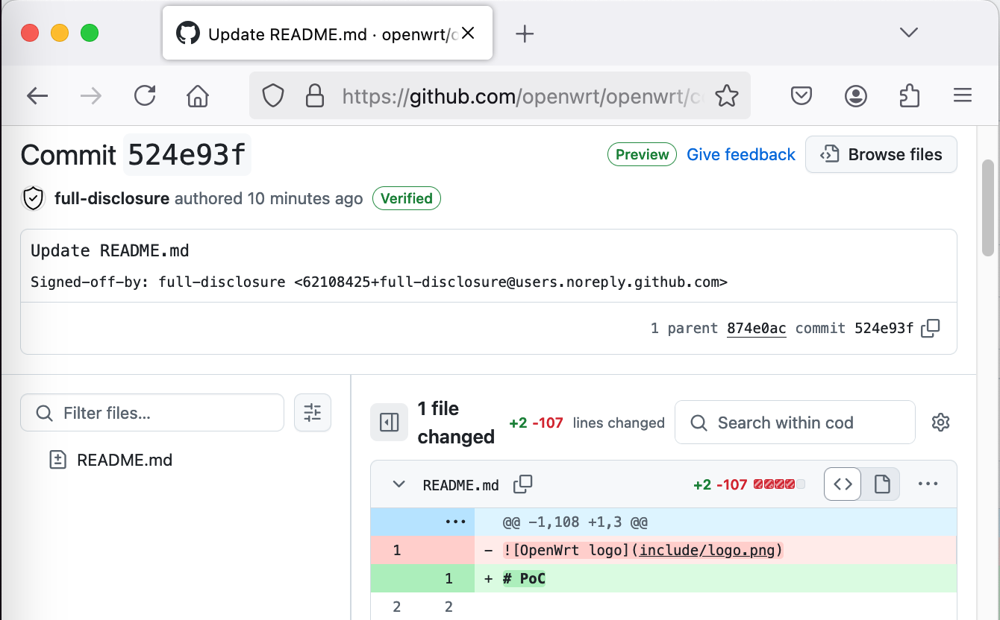
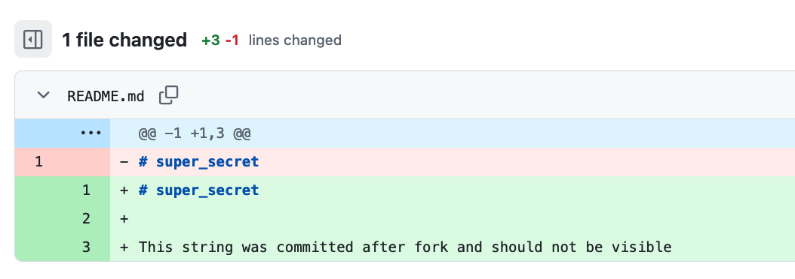

# FDEU-CVE-2025-00fe

# Summary

Bypass of access restrictions of a private Github organization repo.

# Tech details

A private repo of a Github organization can be accessed by direct commit url through a revoked member's private fork.

# Explanation

This may sound a bit fizzy, but here is an explanation:

1. An organization creates a private repo in Github.
2. This repo can only be accessed by members of the org. External accounts would get 404 when trying to access that repo.
3. An org's member (non admin) is inviting an external collaborator to work on this repo.
4. At this point this collaborator can see and open the repo, clone or create a private fork.
5. Even though the private fork is located at the collaborator's account (visually), it is only visible by the user himself and the org members. That's how Github designed it for security.
6. The initial member gets removed from the organization, and his private fork disappears. He no longer can access nor the organization, nor the private fork that he just had in his account. That's how Github designed it for security.
7. But the private fork of an external collaborator remains alive. The collaborator cannot see the organization repo anymore, cannot see issues, cannot send pull requests, he only has the old code as it was at the time of fork.
8. It turned out that this external account can still access any new commit from the upstream org's repo by directly accessing a slightly modified github url.

The attacker cannot list the private repo and in order to exploit the bug the attacker needs to have an exact commit URL or SHA-1. Because of that the scope of the attack is narrowed to publicly available urls that are often published in changelogs, bug bounty disclosures, public websites or public Github repos that are being used by org members. Anyone who is sharing such a link relies on Github access control, because only org members can access the link, right? Right?

# An old and well known Github's feature

Actually, the trick has been known for quite a long time and has been publicly disclosed many years ago. The Github's comment was: it's not a bug, it's a feature.

Here is an example. The following link appears to show some commit done by OpenWRT organization:

[https://github.com/openwrt/openwrt/commit/524e93f41f4b2c77752771a0d35e61604a2fc6b1](https://github.com/openwrt/openwrt/commit/524e93f41f4b2c77752771a0d35e61604a2fc6b1)

While the link itself may give some credibility, when you open it you see that the commit actually is not made by OpenWRT:

Here, same posted on Reddit 6 years ago:

[https://www.reddit.com/r/programming/comments/a82nec/this_github_url_makes_it_look_like_linux_has_a/](https://www.reddit.com/r/programming/comments/a82nec/this_github_url_makes_it_look_like_linux_has_a/)

# Exploit

To access a commit that is located in the org's repo and is missing in the old private fork an attacker simply needs to replace the name of the org with the github account name that holds the old private repo.

If needed commit's URL is (org name is "the_secret_org", repo name is "secret_repo":

<pre>
https://github.com/the_secret_org/secret_repo/commit/bc6f437fd60b5fcc064ec091d7f3dbe9a82cfd70
</pre>

An attacker can see it here (attackers account name is "external_collaborator"):

<pre>
https://github.com/external_collaborator/secret_repo/commit/bc6f437fd60b5fcc064ec091d7f3dbe9a82cfd70
</pre>

On this screenshot, an attacker (the external collaborator) is able to see a future commit made in the org's private repo.

# Mitigation

Github also made it worse by hiding external forks from the org's admin.

If you are an admin of a private Github organization, you can check what private forks outside of the organization you have. To do that, go to each repository Insights and select Forks. You may see "No forked repositories found". And that's not always true, thanks to Github. Now click on "Switch to list view" - and you will see the complete list of existing external forks. Delete any shown unrecognized fork asap.

# Timeline

<pre>
2024-11-25 - initial research
2024-11-27 - privately contacted Github
2024-11-27 - sent report through a bug bounty platform
2024-12-02 - Github confirmed they received the report
2024-12-06 - report is closed as duplicate
2025-01-02 - full disclosure
</pre>

