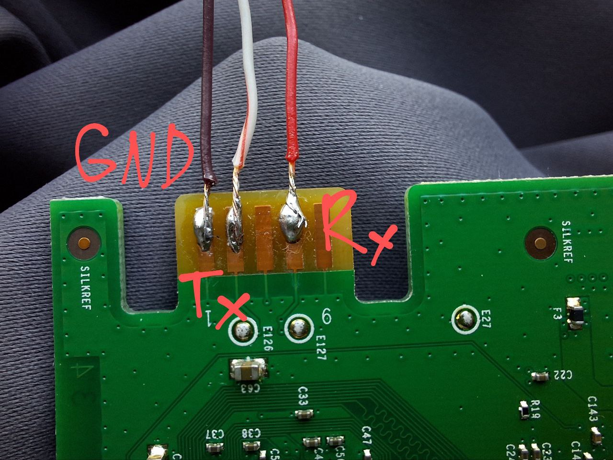
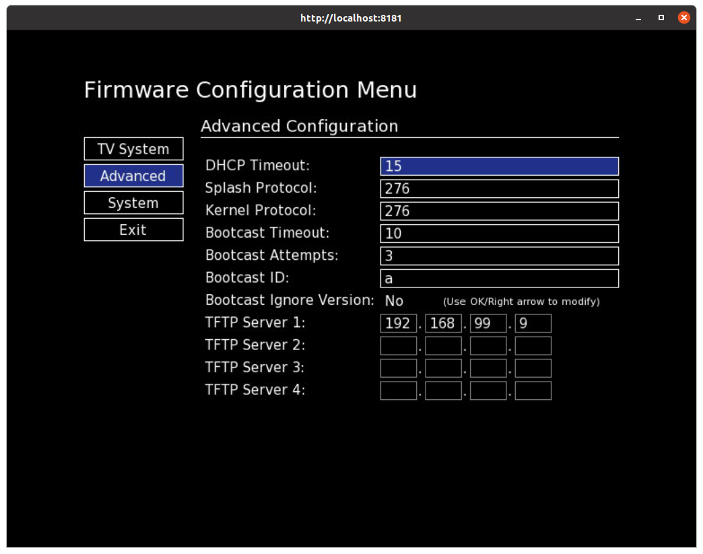

# FDEU-CVE-2025-1c00

# Summary

Bootloader shell injection in various Motorola and Arris tv boxes allows arbitrary code execution with root privileges,
bypass of secure boot, dump encryption keys and boot custom firmware.


# Tech details

The second stage bootloader reads user controlled settings and passes them directly to the command line.
This allows injecting a space char in the tftp command line to shift parameters and control local file name
which in turn allows us to overwire any executable on the file system. After overwriting a binary, the
bootloader then can be instructed to execute the malicious binary under the root user.


# Device overview

Arris VIP1113 was used for this research. It has a SH4 architecture CPU by STMicroelectronics, 512MB of RAM,
128MB of flash storage, USB, HDMI, microSD and ethernet port.

It runs an "STLinux" kernel and the userspace software is created by Motorola and provided under the KreaTV SDK
brand name. Toolchain is open source and can be freely downloaded from Arris Sourceforge account.

The sample second-hand box we got was used by Telia provider (Lithuania).


# Serial console

Arris has developed their own slot-style connector for the serial console, but you can solder the wire just on top,
there is plenty of space for that. Baud rate is 115200.





# Hidden menu

There is a hidden menu mentioned in the SDK documentation with a note, that the password should not be disclosed
to the end users. But here it is:

1. Press menu on the remote to interrupt the boot
2. Press 2 3 5 7 on the remote to unlock IP settings menu
3. Press 7 5 3 2 on the remote to unlock configuration menu





# Injection

Some of the settings you put into the hidden configuration menu will be passed directly on the command line without
properly escaping. For example, this `multicast` help message printed on the serial console indicates that some
bad parameter was provided:

```
Loading splash image
Using Local Storage
LS: Image found
Usage: multicast -o <output file> -p <bc/sap>
             	-a <metadata address>
             	-h <hw rev> -t <splash/kernel>
             	-i <timeout> -r <retires> -v <version file>
             	-m <mode: info/download/version/blob>
             	-f <optional (sap only): forced software version>
             	-b <blobname (only in blob mode)>
Child process (/usr/bin/multicast) exited with failure code 1
```


# TFTP boot exploit

The bootloader has a feature to pull firmware images from a tftp server. To do that the following command line gets executed:

```
$ tfp something remote_file  local_file something
```
While we don't know the exact number of params for "something", we know that we control `remote_file` through the
hidden menu, but we don't control `local_file` as it is passed as a hardcoded string to the command line.

However by injecting a space into `remote_file` we can split it into two and shift the rest of parameters on the
right by one. For example, if we provide "aaa bbb" remote file name, the command will look like this:

```
$ tfp something aaa bbb local_file something
```
Now we can control both remote ("aaa") and local ("bbb") file names. This allows us to overwrite any executable
on the file system.


# Chaining vulnerabilities

To be able to execute our dropped binary we have to adjust the bootloader settings to try `multicast` protocol if tftp
fails. This is done by providing boot protocol value `21`. `2` means first try `tftp`, `1` means try multicast if tftp
failed. By chaining all together:

```
Negotiation transfer size = 516744
Download completed
Unable to open file /tmp/bootimage.gz.sec: No such file or directory
utilman: Unable to open '/tmp/bootimage.gz.sec'
Loading kernel image
Using Bootcast
aaaa pwned
```

PoC:

```
$ echo "/tmp/busybox id" | nc 192.168.99.97 1337
uid=0 gid=0

$ echo "/tmp/busybox cat /proc/version" | nc 192.168.99.97 1337
Linux version 2.6.32.59_stm24_0211 (<build_user_removed>@<build_host _removed>)
(gcc version 4.7.3 20130514 (GCC)) #1 PREEMPT <timestamp_removed>
```

# Firmware encryption key

Since we now have a root shell we can poke around and collect some good stuff that was previously hidden. One of such is
the actual firmware contents which is encrypted using the AES-ECB key that is only available to the bootloader.

One way to do it would be to reverse engineer the bootloader's binary (which we now have) and another way is to dump the
whole RAM memory and try to guess the key.

We want to avoid the Ghidra nightmare which is so bad for decompiling SH4. Therefore we choose dumping. Dumping RAM is easy.
We took the source code of `2.6.32.59` kernel and compiled the LiME forensics module. Finding the key among 536870912 bytes
would be challenging, especially given that we have no idea how to verify if decryption was successful. However, Motorola
helped a lot: the key has a special binary header with a magic string `SEC`. This allowed to find the exactly one occurrence
in the memory dump and the firmware was successfully decrypted:

```
key=`cd1c2d78f2cba1f73ca7e697b4a485f49a8a7d0c8b0fdc9f51ced50f2530668a`
openssl enc -d -aes-256-ecb -K $key -in firmware.bin -nopad
```


# Secure boot bypass

Firmware images are not only encrypted, but also signed using an RSA key. The private key is not available for us, therefore
we would not be able to boot a modified firmware. Unless we can bypass the secure boot.

The secure boot is implemented as following:

1. Firmware is pulled into `/tmp/bootimage.gz.sec` local file
2. Decryption into a new file `/tmp/bootimage.gz`
3. Validation
4. Unpacking into a new file `/tmp/bootimage`
5. Booting `/tmp/bootimage` using `kexec`

The most important part for us in this process is that unpacking happens after the image gets validated. And the unpacking is
done by calling a local binary `/usr/bin/gunzip`. Since we already control the entire file system we can provide our own fake
`gunzip` binary which will extract and do some modifications. This allows us to bypass secure boot protection and boot a modified firmware.


# Custom Linux boot

There is also a way to not just modify the firmware, but build a completely brand new boot image and boot it. The toolchain
provided by Motorola is pretty straightforward and the image builds fine out of the box. The only important thing is that
you have to use Ubuntu 14 docker image for building. An example `Dockerfile` (supports Arris VIP1113, Motorola 1003 and Arris VIP5305):

```
FROM ubuntu:14.04
RUN dpkg --add-architecture i386
RUN apt-get update
RUN apt-get install -y libc6-dev-i386 lib32z1
RUN apt-get install -y quilt make gcc g++ python rpm2cpio hostname file indent unzip bison flex gperf
RUN apt-get install -y xz-utils bc squashfs-tools vim
RUN mkdir /usr/local/kreatv
RUN mkdir /usr/local/motorola
COPY kreatv-kit-ossk_4.6_to_4.9_st40/toolchain_st40_4.0.1.tar.bz2 /usr/local/kreatv
COPY VIP5305-kreatv-hi53_5.2.1/toolchain_hi53_2.0.2.tar.bz2 /usr/local/kreatv
COPY toolchain_st40_2.3.0.tar.bz2 /usr/local/motorola
RUN cd /usr/local/kreatv && tar xvf toolchain_st40_4.0.1.tar.bz2 && tar xvf toolchain_hi53_2.0.2.tar.bz2
RUN cd /usr/local/motorola && tar xvf toolchain_st40_2.3.0.tar.bz2
```

# Other vulnerable models

Since Motorola and Arris tv boxes share pretty the same second stage bootloader, we estimate all of the
models may be affected by this shell injection vulnerability.

Tested:

* Motorola VIP1920 - similar STIH207 CPU, vulnerable to injection, tftp binary different
* Motorola VIP1003 - similar STIH207 CPU, vulnerable, same tftp binary
* Arris VIP5305 - different CPU Huawei hi53, not tested yet


# Responsible disclosure

There was no response neither from the vendor, nor from MITRE. After 90 days of deadline this 0-day exploit was
presented at BSides Vilnius.


# Timeline

<pre>
2021-02-16 - initial research
2022-03-11 - got Motorola VIP1920-9DCB Zaptor initrd for analysis (thanks to duff.dk)
2025-02-24 - got hands on motorola 1920 box to validate exploit
2025-02-25 - exploit poc done
2025-02-28 - CVE ID request sent to MITRE
2025-03-02 - sent emails to Commscope, Vantiva and Arris
2025-03-03 - sent email reminder to MITRE
2025-05-22 - presented the research at BSides Vilnius
2025-05-30 - full disclosure
</pre>
